# Social Recovery — UX Flow Diagrams (working doc)

> Working document. Owner: Fibo. Status: **reviewed — 6-perspective review pass applied 2026-08-12**.
> Sources: social-recovery prototype HTML (demo), the Notion
> [Personas page](https://app.notion.com/p/36d9a4c092c780578f9dde36e69dfff5) (Alice → Sam),
> Design Rationales R1–R13. Scope note: this document focuses on the **UX of the
> initiative**; contract-level details live in the tech design and are only referenced
> where a UX flow depends on them.
>
> Framing: the social recovery initiative is a **general-purpose improvement for the
> ecosystem**. This extension is the demo/reference app that shows what can be done.
> These flows are therefore **reference UX**, not app-only decisions.
> This document lives as a **sibling to the Notion pages** (personas, rationales).
>
> Naming (decided): the user-facing label is **"Account recovery"**. "Social Recovery
> (Kit)" stays as the internal/tech name only.
> User-facing vocabulary (decided): **"recovery path"** = one clause/card,
> **"method"** = one credential, **"waiting period"** = timelock. "Policy", "proof",
> "relayer", "EIP-712" stay in spec prose only.
>
> Context: the UX lives under **Settings › Account recovery**. The recovery module is
> ERC-7579, on a 4337 smart account or a 7702-upgraded EOA. 7702 vs 4337 copy
> differences: deferred. Chain scope: **one chain per policy**; demo runs on
> **Sepolia**; focus is Ethereum. **Multichain: out of scope for v1** (decided) —
> note for integrators: rotation happens on one chain; the same address on other
> chains stays locked.

---

## Flow A — Extension first open (entry points)

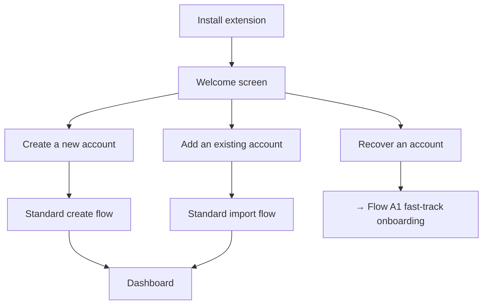

### Flow A1 — Fast-track onboarding (recovery-focused)

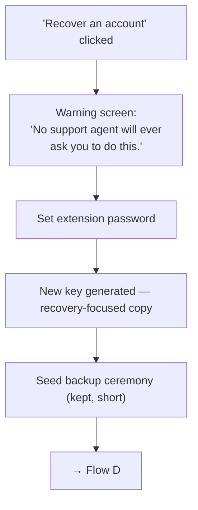

Decisions:
- ✅ Fast-track = **warning screen + extension password + key creation + seed
  backup**. Nothing else.
- ✅ Seed backup is not deferred. It stays in the fast-track.
- ✅ Copy at key creation (corrected): "**Your account stays at the same address.**
  This new key will control it." (Nothing "moves"; the address never changes.)

---

## Flow B — Recovery-methods check + nudge

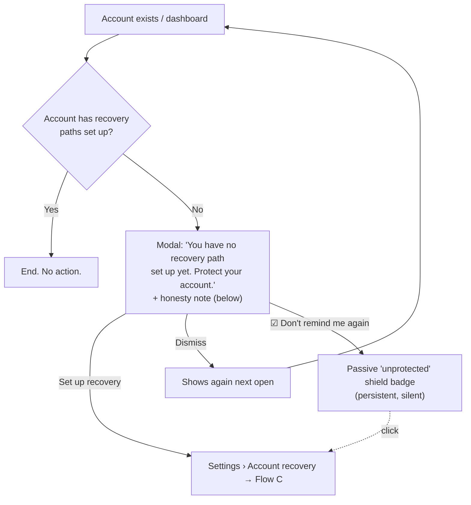

Decisions:
- ✅ Trigger: each dashboard open until the user acts or opts out.
- ✅ Permanent dismiss keeps the shield badge as re-entry point. Concretely: a small
  shield icon in a warning state, shown permanently on the account row and on the
  Settings › Account recovery entry while the account has no recovery path. It never
  pops up and never blocks anything. Clicking it opens setup (Flow C).
- ✅ Honesty note, concrete copy: "Recovery protects you if you **lose** your key.
  It cannot stop someone who already has it. And if your only method is a passkey on
  this device, losing the device also removes this recovery path."

---

## Flow C — Recovery setup

Building blocks:
- **Methods:** passkey, guardians (people's wallets, EOA or SCW), ZK Email, Anon Aadhaar.
- **Recovery paths:** OR of AND clauses. Each path has its own waiting period.
- **A path can be a lone OR-group** (no required rows): Alice's guardians-only
  `3-of-5` is one path with the threshold inside the guardian method. The builder
  must support this shape explicitly.
- **Presets can be reduced to a single method** (Sam's floor). The builder must
  support one-method paths; the honesty note (Flow B copy) doubles as their warning.
- **Mixed-method OR-groups** (`passkey AND [zk_email OR aadhaar]`): **decided —
  valid** (assumed). Works the same as the guardian case
  `passkey AND [Guardian A OR Guardian B]`. The exact contract encoding sits with
  the kit team (tech-dependencies table).

### Three setup modes

| Mode | For | Shape |
|---|---|---|
| **Express** | Least technical | Short guided wizard. Per-step education, minimal UI. |
| **Presets** | Middle ground | Pre-defined recovery paths in place; user removes/edits. |
| **Advanced** | Most technical | Free builder (grouped condition pattern). |

**Entry pattern:** no three-way fork. The tab **lands on the Presets state**; two
actions on top: **"Guide me"** (Express) and **"Customize"** (Advanced).

**Starter presets (updated): three recovery paths shown by default**, 48h waiting
period each, all starting in "needs setup" state with deep-links into enrollment:
1. `passkey AND [guardians threshold group]` — your device + your people.
2. `passkey AND zk_email` — your device + your email. (Note: violates R9 when the
   passkey is Google-synced and the email is Gmail — accepted for now.)
3. `guardians-only, M-of-N` — people only, no device or platform dependency
   (added for the Alice/paper-guardian profile; also the only preset with no passkey).

### Express wizard — step list

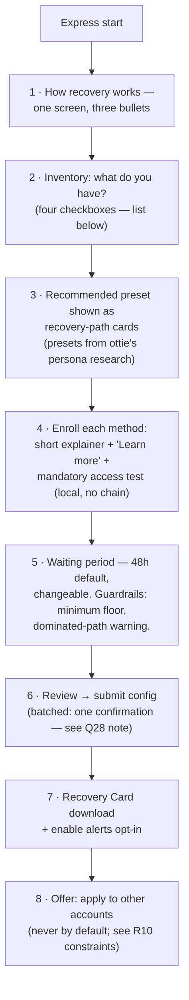

Inventory items (step 2):
- ☐ another device (passkey-capable)
- ☐ trusted contacts with wallets
- ☐ long-lived email
- ☐ Aadhaar ID (last, badged)

The recommended presets in step 3 come from the
[persona research (Notion)](https://app.notion.com/p/36d9a4c092c780578f9dde36e69dfff5).

Wizard state rules:
- ✅ **Draft/resume:** progress persists locally; abandoning mid-wizard re-enters at
  the last completed step. Enrollments without a saved on-chain config show as
  "not yet active".
- ✅ **Alerts opt-in (step 7):** request notification permission here — Flow D2
  depends on it. If denied: degraded banner-only behavior, stated to the user.

### Verify-access at enrollment

Mandatory for identity methods; a failing test blocks the save. Local only, no chain.

| Method | Test |
|---|---|
| Passkey | Sign a test challenge right after creation. Instant. |
| ZK Email | Generate a full test proof locally. Depends on Q16. Progress UI; doubles as dry run. |
| Anon Aadhaar | Test proof against the current UIDAI key. |
| Guardians | **Optional, open**: light checks (checksum, ENS resolution, contract detection, same-seed). A real signature test needs the guardian to act — also optional. |

### Recovery Card (step 7)

Contents — **only**: the account address, a short "how to start recovery" guide, and
the canonical approval-page URL. Plus the line "this card alone cannot move funds."

Explicitly **kept off the card** (decided, with rationale): the method inventory,
guardian names or contacts, the enrolled email address, thresholds, and waiting-period
values. Reason: the card is designed to be stored insecurely — that is its job. A
stolen or copied card must not become a **map of exactly which methods to phish**.
The address alone is public information anyway; the configuration is the secret.

### Multi-account "apply this setup" (R10 constraints)

- ZK Email `accountCode` derivation per account: **open question** (moved to the
  tech-dependencies table).
- ✅ Passkey and guardian reuse across accounts is observable on-chain (per R10).
  Show a linkability warning and offer "create a fresh passkey for this account".
- Never applied by default.

Other decisions:
- ✅ All 4 methods in v1. Aadhaar for everyone, listed last, badged.
- ✅ Waiting period: 48h flat default, **confirmed to stand also for single-method
  paths**. Changeable per path. Builder guardrails: a minimum floor (zero-second
  waiting periods must not be configurable) and a **dominated-path warning**.
  Definition: path Y is dominated when another path X needs a **subset** of Y's
  methods and has an equal-or-shorter waiting period — anyone who can complete Y can
  always use the easier X instead, so Y adds zero security. Example: with
  X = `passkey` (48h), Y = `passkey AND zk_email` (48h) is pointless. The warning
  suggests giving the stronger path a shorter waiting period, or removing one of
  the two.
- ✅ Express presets and their contents come from **ottie's persona research**.
- Advanced-builder helper (nice-to-have, from review): an "M-of-N across methods"
  macro that auto-expands pair clauses.

### UI pattern references (solved problem)

Grouped condition builder with "ALL of / ANY of" headers: Notion/Airtable advanced
filters, Apple Smart Playlists, Zapier paths, Stripe Radar, `react-querybuilder`.
Threshold selector inside a group: Safe's "M out of N owners" row.

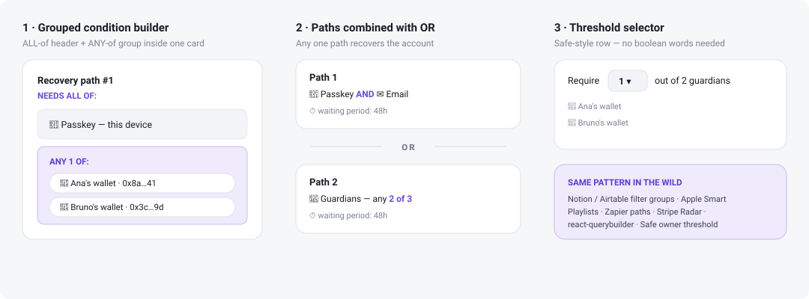

---

## Flow D — Recover an account

Preconditions — a key that will receive control, from either entry point:
- fresh install → the fast-track onboarding creates it (Flow A1);
- **logged-in** → an existing account is the new owner (see "Flow D additions" below).
⚠️ **Funding & execution: BLOCKER, unresolved.** `initiate/executeRecovery` are
permissionless direct calls that bypass the 4337 flow — a 4337 paymaster cannot
sponsor them, and the SDK design is backend-zero (no relayer exists today). "Who pays
and who executes" has no owner. The flow below names the intended UX; the
infrastructure question is in the tech-dependencies table.

**Config visibility:** the policy **structure** is readable on-chain
("passkey + zk_email"). Value visibility is **OPEN**: in the current contracts,
guardian addresses are natively public (R10 calls them observable); whether values
can be hidden at all sits with the kit team. Case to design for either way: values
encrypted with a **user password** — the recoverer enters it to decrypt and see the
real values (e.g. which guardians to contact).

The flow is chaptered into its three phases so each diagram stays readable.

**Chapter 1 — Identify the account**

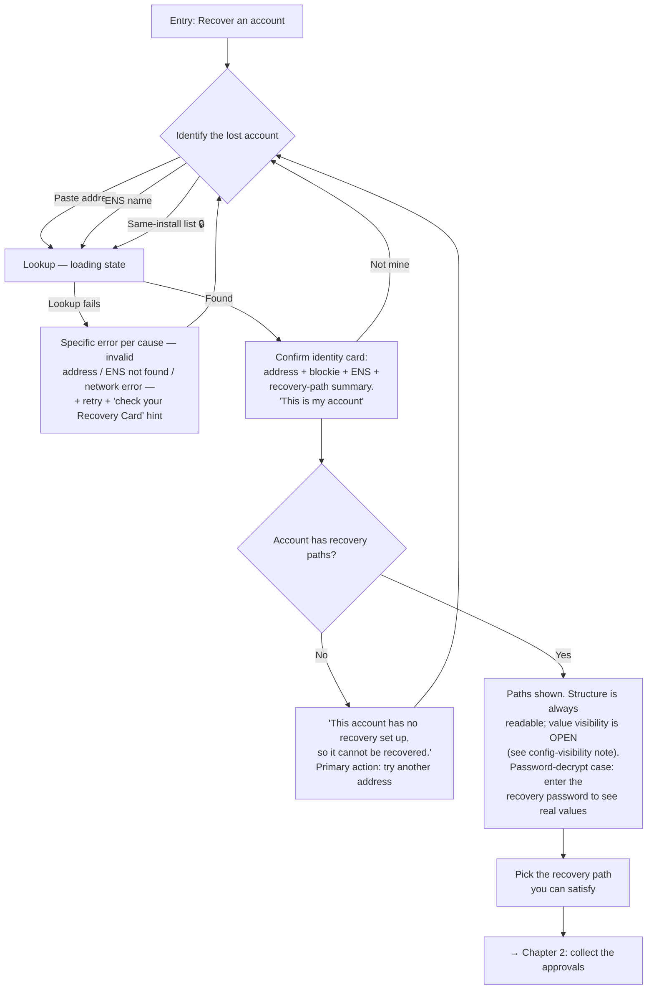

**Chapter 2 — Collect the approvals**

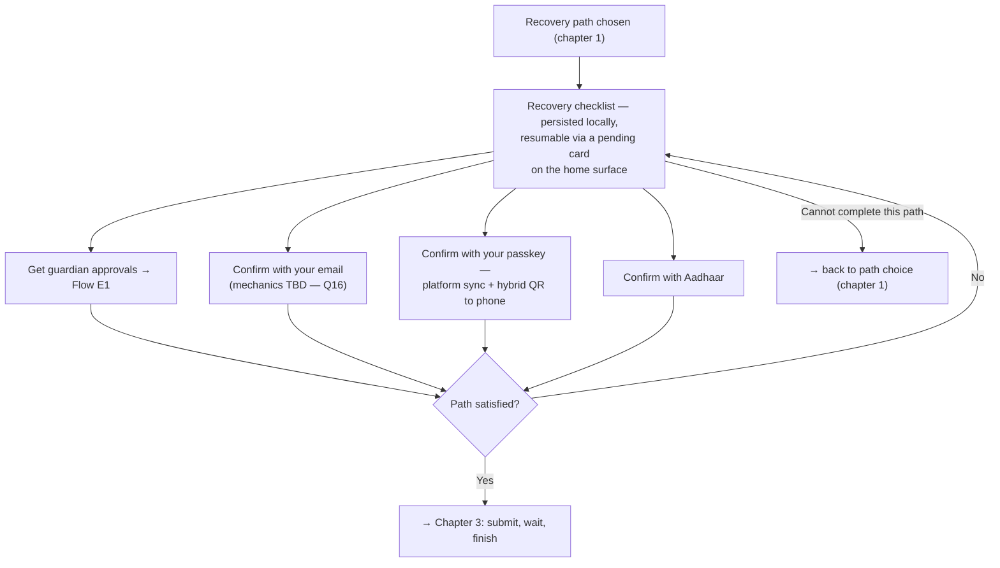

**Chapter 3 — Submit, wait, finish**

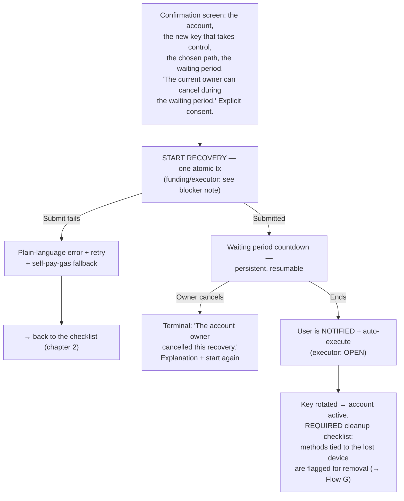

Decisions:
- ✅ Identify by pasted address, ENS, or the gated same-install list (full
  wallet-unlock strength, no balances shown, usage logged).
- ✅ Confirm-identity card before any proof collection (restored from the demo).
- ✅ Checklist has an explicit "switch to a different recovery path" exit; reusable
  approvals are preserved.
- ✅ Submit failures get plain-language errors, retry, and a self-pay-gas fallback.
- ✅ The countdown has a **cancelled** terminal state — the recoverer never waits
  into silence.
- ✅ End of recovery = **required cleanup checklist**, not a soft nudge: the surviving
  config still contains the lost device's methods; whoever holds that device can
  start a new recovery. Flag and walk through their removal.

## Flow D additions — logged-in entry & interactive claims

### Logged-in entry (Settings)

Recovery does not require a fresh install. A logged-in user starts it from the
**"Recover an account"** button on the Settings › Account recovery overview (Flow G).

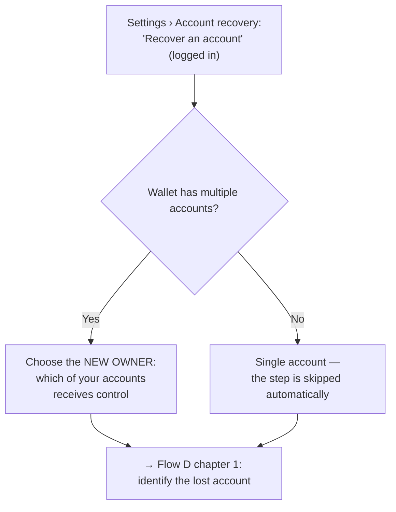

Decisions:
- ✅ Logged-in entry exists next to the fresh-install entry.
- ✅ Multiple accounts → the user picks which account becomes the new owner.
  A single account skips the step.

### Interactive claim collection (refines Flow D chapter 2)

The checklist is interactive per method of the selected path.

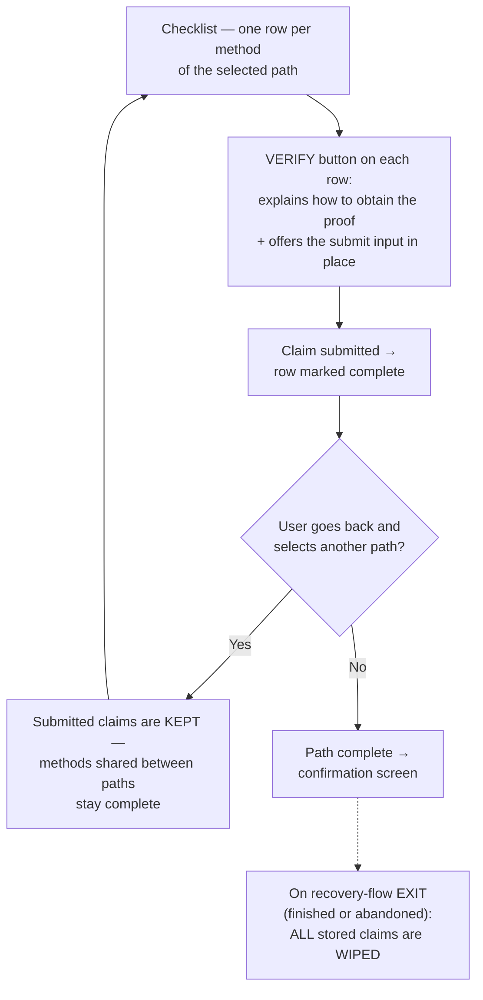

Decisions:
- ✅ Each method row has a **verify button**: it explains how to get the proof and
  gives the way to submit it, in place.
- ✅ Claims **survive path switching**: going back and selecting another policy keeps
  every claim already submitted.
- ✅ Claims are **wiped when the recovery flow exits** — finished or abandoned.
  Security rule: claims never persist beyond the flow.

---

## Flow D2 — Cancel side (original owner's device)

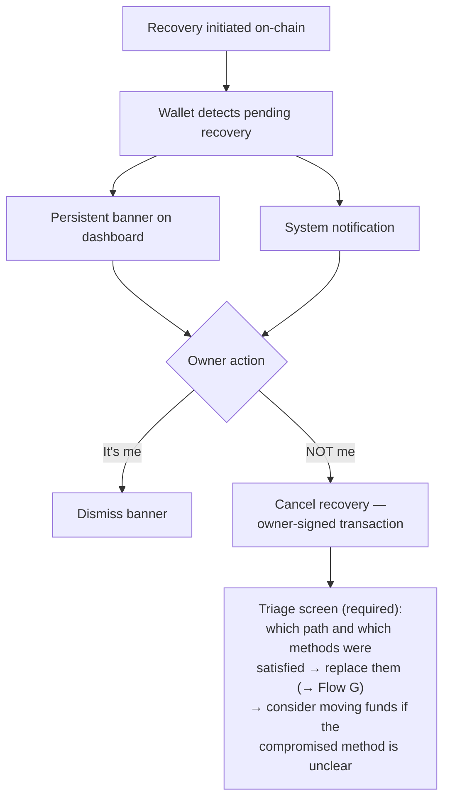

Decisions:
- ✅ Banner + notification. Polling caveat accepted for now (user must open the
  browser during the waiting period). Alerts opt-in in Flow C step 7 mitigates.
- ✅ Cancel is not resolution: the attacker still holds a working method. The triage
  screen is required, not optional.

---

## Flow E — Guardian approval

**E1 (sync) is the default for v1.** E2 (async) stays mapped as a future improvement.
Either way the recovery **trigger stays with one person** (the recoverer).

### Flow E1 — Sync (off-chain signature passing) — DEFAULT

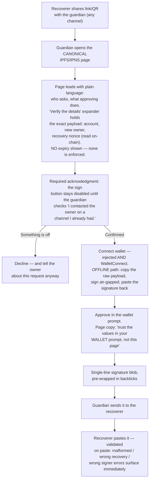

Security rationale (why these steps exist):
- Design principle for guardian-facing surfaces (decided): **"Information should be
  ignorable but verifiable."** Guardians can be non-technical users. Plain language
  leads; the technical detail collapses behind a "Verify the details" expander and
  never blocks the main path.
- The page renders whatever the URL says — an attacker who builds the link controls
  everything it displays. The page is **not** a trust anchor. The two real anchors
  are: the out-of-band call to the owner, and the wallet's own signing prompt.
- The acknowledgment checkbox is UI friction, not enforcement — a static page cannot
  verify that the call happened. It still forces a deliberate pause at the exact
  moment phishing relies on speed.
- Guardians who decline should still tell the owner: off-chain proof collection is
  invisible on-chain, so guardians are the owner's only tripwire during that phase.
- A guardian signature has **no expiry** — it dies only when its nonce is consumed or
  the request is cancelled. Never display a time limit the contract does not enforce.

### Flow E2 — Async (on-chain approval) — FUTURE

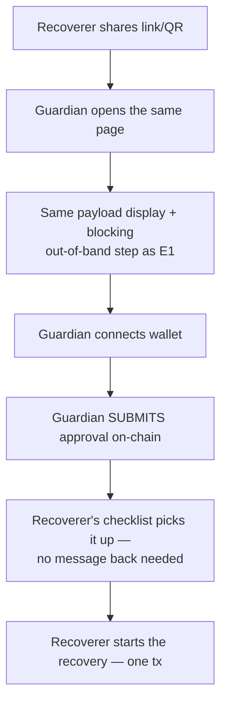

Blockers (secondary to this doc's focus; tracked for completeness): no on-chain
approval function exists in the current contracts (R5 conflict); guardian-side gas
needs sponsorship; detection needs indexing that the backend-zero design removed.

---

## Flow F — Health checks (in scope)

Same machinery as the verify-access tests, run over time.

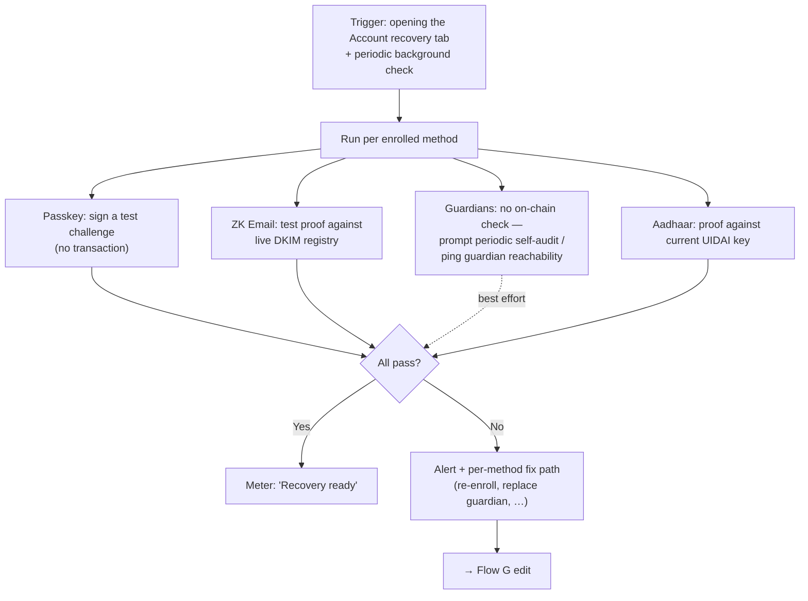

Decisions:
- ✅ Meter label is **"Recovery ready"**, not "Protected" — recovery protects against
  key **loss**, not key theft, and a single-passkey floor must not show the same
  confidence as a 2-of-3. The meter level still scales with path count/strength.

---

## Flow G — Recovery paths & method management

Lives in Settings › Account recovery (demo screens: `sr-policies`, `sr-policy-edit`).
All changes are owner-signed transactions (only the current owner can modify
configuration).

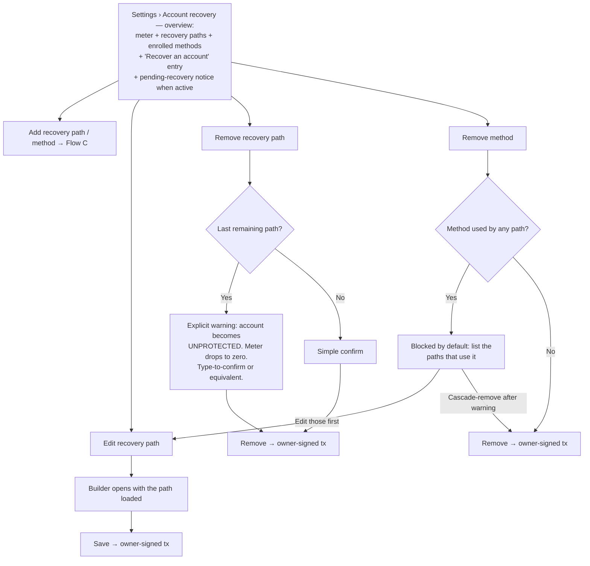

Notes:
- Config changes are allowed while a recovery is pending and do not affect the
  pending request. If a recovery is pending, the management screen says so next to
  every action.
- Guardian replacement is an Edit case; the health-check alert (Flow F) and the
  post-cancel triage (Flow D2) both deep-link here as the fix path.
- "Recover an account" is reachable from this overview too, not only from the
  fresh-install welcome.

---

## Decisions log

| # | Question | Answer |
|---|---|---|
| 1 | Account creation in recovery entry | Explicit step, fast-tracked (Flow A1) + warning screen. |
| 2 | Nudge trigger + re-nudge | Modal each open + "Don't remind me again" + passive shield badge. |
| 3 | Setup modes | Three: Express, Presets (landing state), Advanced. |
| 4 | Method set v1 | All 4. Aadhaar for everyone, listed last, badged. |
| 5 | Terminology | "Account recovery" / "recovery path" / "method" / "waiting period" in UI; spec terms in prose only. |
| 6 | Honest copy for floor cases | Yes — concrete copy in Flow B. 7702 vs 4337 deferred. |
| 7 | Gas for recovery | ⚠️ **Escalated to blocker**: paymaster can't sponsor direct calls; no relayer exists (backend-zero). |
| 8 | Identify lost account | Address / ENS / gated same-install list + confirm-identity card. |
| 9 | Guardian-side UX | Hardened IPFS/IPNS page (E1 default): real payload incl. nonce, no fake expiry, blocking out-of-band step, decline branch, offline signing. |
| 10 | Proof collection state | Local persistence, resumable, switch-path exit; atomic submission. |
| 11 | Pending-recovery alert | Banner + notification + alerts opt-in at setup. Polling caveat accepted. |
| 12 | Waiting period default | 48h flat, changeable. **Confirmed also for single-method paths.** Guardrails: minimum floor + dominated-path warning. |
| 13 | Multi-account | Offer "apply same setup" with R10 constraints (fresh accountCode auto; linkability warnings). Never by default. |
| 14 | Health checks | In scope → Flow F. Meter = "Recovery ready". |
| 15 | Chain scope | One chain per policy. Ethereum focus, Sepolia demo. Multichain out of scope v1. |
| 16 | ZK Email mechanics | **Open** — blocks that method's sub-flows. |
| 17 | Passkey on new device | Platform sync + WebAuthn hybrid. |
| 18 | Guardian page wallets | Injected + WalletConnect + offline signing path. |
| 19 | After waiting period | Notify + auto-execute — intended UX; **executor unresolved** (see #7). |
| 20 | Config survives rotation? | Assume yes → makes the end-of-recovery cleanup checklist REQUIRED. |
| 21 | Express presets | Owned by ottie's persona research. |
| 22 | Mixed-method OR-groups | **Decided — assumed valid** (same as guardian OR case, PR #2 review). Encoding confirmation with kit team (T10). |
| 23 | Guardian gas (E2) | Needs sponsorship; one of E2's three blockers. |
| 24 | Multichain | Out of scope v1. |
| 25 | Fast-track onboarding | Warning screen + password + key + seed backup. Corrected copy (address never changes). |
| 26 | Express wizard shape | Guided, short, inventory step; draft/resume; alerts opt-in. |
| 27 | Verify-access | Mandatory for identity methods; guardians optional, open. Mutual guardian approval = under consideration. |
| 28 | Setup gas / batching | User pays if funded, else paymaster. Batching partially answered (thread T7: one batched UserOp — conceded, unwritten). |
| 29 | Config visibility | Structure readable; value visibility OPEN (guardian addresses natively public today); password-decrypt case stays. |
| 30 | R9 orthogonality gate | **Not now** — invariants/tech design under rework; violations allowed; revisit later. |
| 31 | Guardian mutual approval | Best-effort stands; mutual approval noted as a considered path. |
| 32 | Management flows | Mapped → Flow G. |
| 33 | User-facing name | "Account recovery". |
| 34 | Logged-in recovery entry | Settings button. Multiple accounts → choose the new owner; single account → step skipped. |
| 35 | Claim handling in the checklist | Per-method verify button (explain + submit in place). Claims survive path switching; wiped on flow exit. |

---

## Tech dependencies — route to the kit team

| Item | Blocks | Ref |
|---|---|---|
| **Funding & execution**: who pays and who executes `initiate/executeRecovery` (bypass 4337; backend-zero = no relayer) | Flow D entirely; Decision 19 | Q7/19 |
| ZK Email mechanics (user action; client vs hosted prover) | ZK Email sub-flows + verify-access | Q16 |
| Confirm the encoding for mixed-method OR-groups (assumed valid; T10 `threshold` field) | Builder + preset encoding | Q22 |
| ZK Email `accountCode` derivation per account (R10 unlinkability requirement) | Multi-account apply | — |
| Exact guardian signed payload (nonce display; add `policyId`?; expiry — define or confirm none) | Flow E1 page | — |
| Policy value visibility (guardian addresses are natively public today — can values be hidden at all?) + password-encrypted values case | Flow D entry + path display | Q29 |
| R5 conflict (atomic vs incremental); E2 needs an approval function + indexing | Flow E2 | — |
| Setup batching: write T7's one-UserOp answer into the spec | Wizard step 6 | Q28 |
| Config survival after rotation (+ `onUninstall` nonce-reset issue) | Flow D end state | Q20 |
| Same-install account history lookup, gated | Flow D identify step | Q8 |
| Enforced minimum waiting period on-chain (zero-second currently legal) | Builder guardrails | — |
