# Social Recovery — UX Flow Diagrams (working doc)

> Working document. Owner: Fibo. Status: **reviewed — 6-perspective review pass applied 2026-08-12**.
> Sources: social-recovery prototype HTML (demo), the Notion
> [Personas page](https://app.notion.com/p/36d9a4c092c780578f9dde36e69dfff5) (Alice → Sam),
> Design Rationales R1–R13. Scope note: this document focuses on the **UX of the
> initiative**; contract-level details live in the tech design and are only referenced
> where a UX flow depends on them.
>
> Framing: the social recovery initiative is a **general-purpose improvement for the
> ecosystem**. This extension is the demo/reference app that shows what can be done.
> These flows are therefore **reference UX**, not app-only decisions.
> This document lives as a **sibling to the Notion pages** (personas, rationales).
>
> Naming (decided): the user-facing label is **"Account recovery"**. "Social Recovery
> (Kit)" stays as the internal/tech name only.
> User-facing vocabulary (decided): **"recovery path"** = one clause/card,
> **"method"** = one credential, **"waiting period"** = timelock. "Policy", "proof",
> "relayer", "EIP-712" stay in spec prose only.
>
> Context: the UX lives under **Settings › Account recovery**. The recovery module is
> ERC-7579, on a 4337 smart account or a 7702-upgraded EOA. 7702 vs 4337 copy
> differences: deferred. Chain scope: **one chain per policy**; demo runs on
> **Sepolia**; focus is Ethereum. **Multichain: out of scope for v1** (decided) —
> note for integrators: rotation happens on one chain; the same address on other
> chains stays locked.

---

## Flow A — Extension first open (entry points)

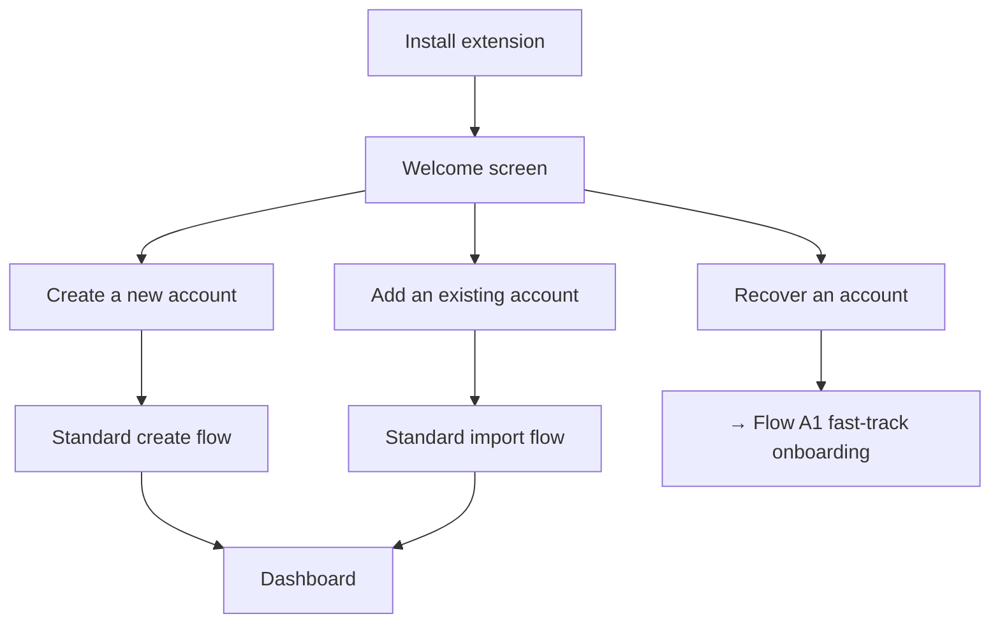

### Flow A1 — Fast-track onboarding (recovery-focused)

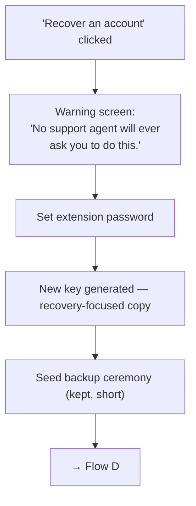

Decisions:
- ✅ Fast-track = **warning screen + extension password + key creation + seed
  backup**. Nothing else.
- ✅ Seed backup is not deferred. It stays in the fast-track.
- ✅ Copy at key creation (corrected): "**Your account stays at the same address.**
  This new key will control it." (Nothing "moves"; the address never changes.)

---

## Flow B — Recovery-methods check + nudge

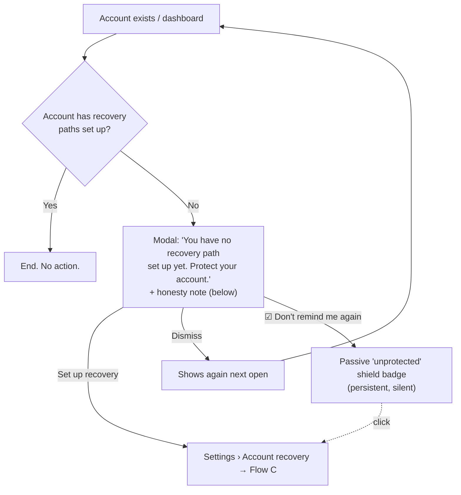

Decisions:
- ✅ Trigger: each dashboard open until the user acts or opts out.
- ✅ Permanent dismiss keeps the shield badge as re-entry point. Concretely: a small
  shield icon in a warning state, shown permanently on the account row and on the
  Settings › Account recovery entry while the account has no recovery path. It never
  pops up and never blocks anything. Clicking it opens setup (Flow C).
- ✅ Honesty note, concrete copy: "Recovery protects you if you **lose** your key.
  It cannot stop someone who already has it. And if your only method is a passkey on
  this device, losing the device also removes this recovery path." The passkey
  sentence adapts to the detected type (synced passkeys depend on the platform
  account instead of the device).

---

## Flow C — Recovery setup

Building blocks:
- **Methods:** passkey, guardians (people's wallets, EOA or SCW), ZK Email, Anon Aadhaar.
- **Recovery paths:** OR of AND clauses. Each path has its own waiting period.
- **ANY-of groups are generic (decided 2026-08-13):** a group's members can be ANY
  method instances — guardians, passkeys, ZK Email, Aadhaar — mixed freely.
  `passkey AND [Ana OR zk_email]` is one path. Guardians are not special:
  "3 of 5 guardians" is simply a group whose five members happen to be guardians.
  No guardian-specific threshold concept exists in the UX.
- **Every group carries an M-of-N threshold** ("Require 2 ▾ of: passkey, Ana,
  email"), not only 1-of-N.
- **A path is a free mix** of required method rows and ANY-of groups, all combined
  with AND — including a lone group (Alice: one group, any 3 of its 5 guardian
  members) and a single method (Sam's floor). A group can have a single member
  (Carl: `passkey AND [Sara]`, a 1-of-1 group). Waiting periods stay per-path,
  never per-group.
- **Presets can be reduced to a single method** (Sam's floor). The builder must
  support one-method paths; the honesty note (Flow B copy) doubles as their warning.
- **Recoverer side:** the recovery checklist renders a group as "any M of N" — a
  group header with progress ("1 of 2 done") — and the path completes when every
  required row and every group threshold is met.
- Contract encoding for generic M-of-N groups sits with the kit team
  (tech-dependencies table; T10 `threshold` field).

### Three setup modes

| Mode | For | Shape |
|---|---|---|
| **Express** | Least technical | Short guided wizard. Per-step education, minimal UI. |
| **Presets** | Middle ground | Pre-defined recovery paths in place; user removes/edits. |
| **Advanced** | Most technical | Free builder (grouped condition pattern). |

**Entry pattern:** no three-way fork. The tab **lands on the Presets state**; two
actions on top: **"Guide me"** (Express) and **"Customize"** (Advanced).

**Starter presets (updated): three recovery paths shown by default**, 48h waiting
period each, all starting in "needs setup" state with deep-links into enrollment:
1. `passkey AND [any 1 of your people]` — your device + your people.
2. `passkey AND zk_email` — your device + your email. (Note: violates R9 when the
   passkey is Google-synced and the email is Gmail — accepted for now.)
3. `guardians-only, M-of-N` — people only, no device or platform dependency
   (added for the Alice/paper-guardian profile; also the only preset with no passkey).

### Express wizard — step list

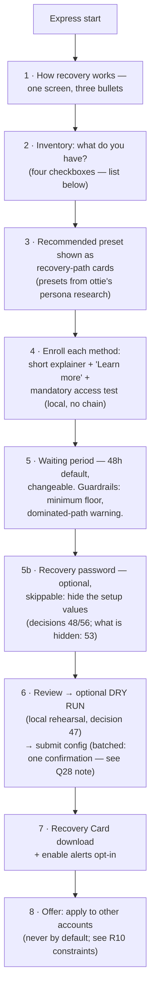

Inventory items (step 2):
- ☐ another device (passkey-capable)
- ☐ trusted contacts with wallets
- ☐ long-lived email
- ☐ Aadhaar ID (last, badged)
- ☐ keys you keep yourself — paper or hardware (routes to guardian-address entry)

The recommended presets in step 3 come from the
[persona research (Notion)](https://app.notion.com/p/36d9a4c092c780578f9dde36e69dfff5).

Wizard state rules:
- ✅ **Draft/resume:** progress persists locally; abandoning mid-wizard re-enters at
  the last completed step. Enrollments without a saved on-chain config show as
  "not yet active".
- ✅ **Alerts opt-in (step 7):** request notification permission here — Flow D2
  depends on it. If denied: degraded banner-only behavior, stated to the user.

### Verify-access at enrollment

Mandatory for identity methods; a failing test blocks the save. Local only, no chain.

| Method | Test |
|---|---|
| Passkey | Sign a test challenge right after creation. Instant. |
| ZK Email | Send the prepared email, download the raw `.eml`, wallet verifies/proves locally (decision 55). Progress UI; doubles as dry run. Subject format and prover stack open (Q16). |
| Anon Aadhaar | Test proof against the current UIDAI key. |
| Guardians | **Optional, open**: light checks (checksum, ENS resolution, contract detection, same-seed). A real signature test needs the guardian to act — also optional. |

### Recovery Card (step 7)

Contents — **only**: the account address, a short "how to start recovery" guide, and
the canonical approval-page URL. Plus the line "this card alone cannot move funds."
The password hint idea from the demo-review meeting was **dropped** (decision 48
amended): a hint cannot be validated against leaking the configuration. The card
stays hint-free; the dry run's password-recall row covers the forgetting risk.

Explicitly **kept off the card** (decided, with rationale): the method inventory,
guardian addresses, the enrolled email address, thresholds, and waiting-period
values. (Guardian *names* do not exist anywhere — decision 43: a guardian is an
address, shown as blockie + address or ENS; the wallet stores no contact labels.) Reason: the card is designed to be stored insecurely — that is its job. A
stolen or copied card must not become a **map of exactly which methods to phish**.
The address alone is public information anyway; the configuration is the secret.

### Multi-account "apply this setup" (R10 constraints)

- ZK Email `accountCode` derivation per account: **open question** (moved to the
  tech-dependencies table).
- ✅ Passkey and guardian reuse across accounts is observable on-chain (per R10).
  Show a linkability warning and offer "create a fresh passkey for this account".
- Never applied by default.

Other decisions:
- ✅ All 4 methods in v1. Aadhaar for everyone, listed last, badged.
- ✅ Two-method inventories (e.g. passkey + email only) get **two single-method
  paths** recommended, not an AND pair — lockout is the larger risk at that level
  (Diana's shape). The waiting period stays the flat 48h default.
- ✅ Passkey enrollment detects **synced vs device-bound** (WebAuthn
  backup-eligibility flag). Warnings and floor copy adapt to the type: device-bound
  → "losing the device removes this path"; synced → "this path depends on your
  Apple/Google account".
- ✅ Waiting period: 48h flat default, **confirmed to stand also for single-method
  paths**. Changeable per path. Builder guardrails: a minimum floor (zero-second
  waiting periods must not be configurable) and a **dominated-path warning**.
  Definition: path Y is dominated when another path X needs a **subset** of Y's
  methods and has an equal-or-shorter waiting period — anyone who can complete Y can
  always use the easier X instead, so Y adds zero security. Example: with
  X = `passkey` (48h), Y = `passkey AND zk_email` (48h) is pointless. The warning
  suggests giving the stronger path a shorter waiting period, or removing one of
  the two.
- ✅ Express presets and their contents come from **ottie's persona research**.
- ✅ Wizard "any M of your N methods" recommendations generate **one path with one
  M-of-N group** (single waiting period) — not pairwise path expansions. Different
  waiting periods per combination remain possible as separate paths in Advanced.

### UI pattern references (solved problem)

Grouped condition builder with "ALL of / ANY of" headers: Notion/Airtable advanced
filters, Apple Smart Playlists, Zapier paths, Stripe Radar, `react-querybuilder`.
Threshold selector inside a group: Safe's "M out of N owners" row.

---

## Flow D — Recover an account

Preconditions — a key that will receive control, from either entry point:
- fresh install → the fast-track onboarding creates it (Flow A1);
- **logged-in** → an existing account is the new owner (see "Flow D additions" below).
⚠️ **Funding & execution: BLOCKER, unresolved.** `initiate/executeRecovery` are
permissionless direct calls that bypass the 4337 flow — a 4337 paymaster cannot
sponsor them, and the SDK design is backend-zero (no relayer exists today). "Who pays
and who executes" has no owner. The flow below names the intended UX; the
infrastructure question is in the tech-dependencies table.

**Config visibility:** the policy **structure** is readable on-chain
("passkey + zk_email"). Value visibility is **OPEN**: in the current contracts,
guardian addresses are natively public (R10 calls them observable); whether values
can be hidden at all sits with the kit team. Case to design for either way: values
encrypted with a **user password** — the recoverer enters it to decrypt and see the
real values (e.g. which guardians to contact).

The flow is chaptered into its three phases so each diagram stays readable.

**Chapter 1 — Identify the account**

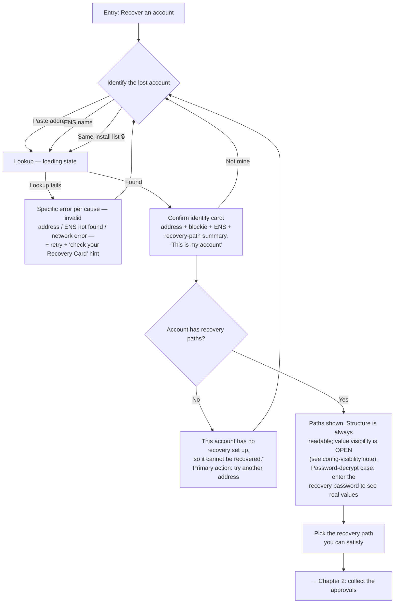

**Chapter 2 — Collect the approvals**

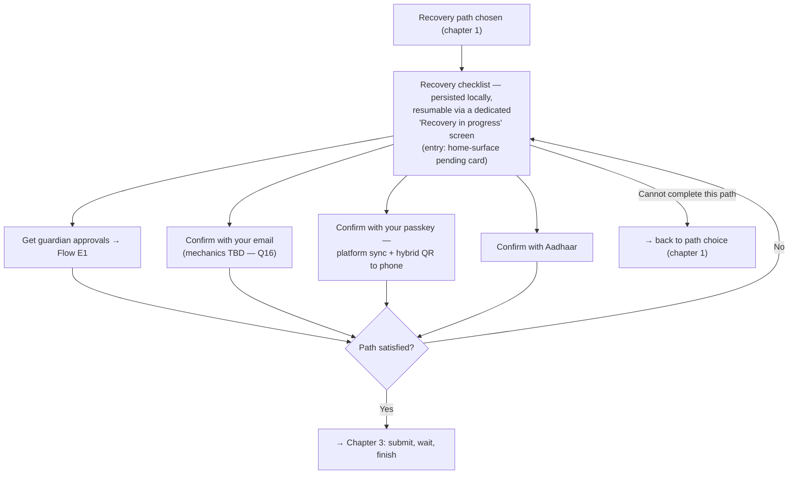

**Chapter 3 — Submit, wait, finish**

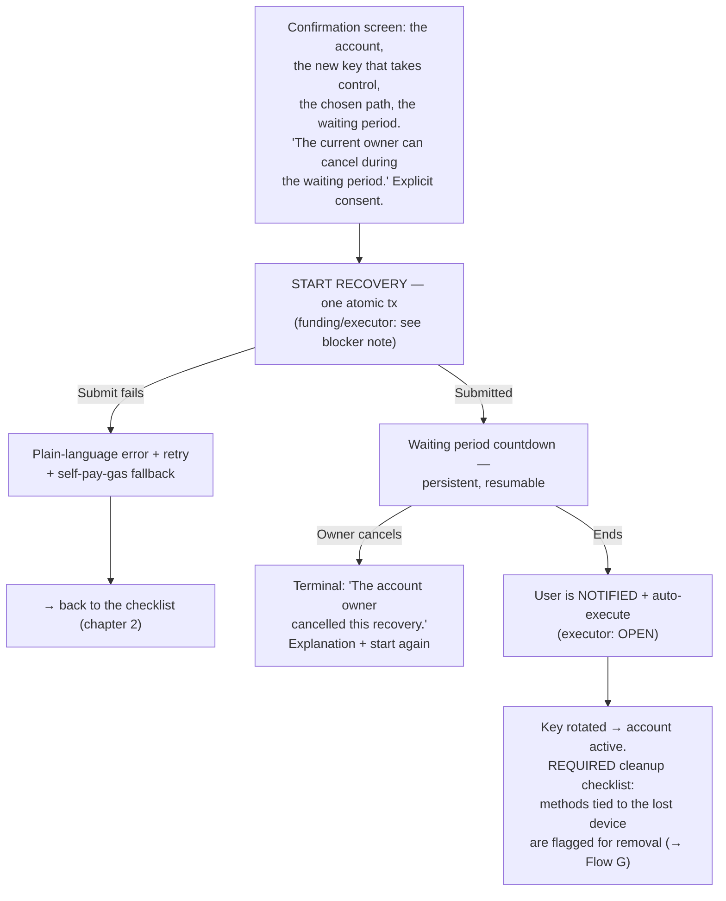

Decisions:
- ✅ Identify by pasted address, ENS, or the gated same-install list (full
  wallet-unlock strength, no balances shown, usage logged).
- ✅ Confirm-identity card before any proof collection (restored from the demo).
- ✅ Checklist has an explicit "switch to a different recovery path" exit; reusable
  approvals are preserved.
- ✅ Resuming an unfinished recovery lands on a dedicated **"Recovery in progress"**
  screen — the account being recovered, per-row progress, resume and abandon actions.
  The home-surface pending card is only the entry point (decision 44).
- ✅ Submit failures get plain-language errors, retry, and a self-pay-gas fallback.
- ✅ The countdown has a **cancelled** terminal state — the recoverer never waits
  into silence.
- ✅ End of recovery = **required cleanup checklist**, not a soft nudge: the surviving
  config still contains the lost device's methods; whoever holds that device can
  start a new recovery. Flag and walk through their removal. Deferring is allowed,
  but the deferral surfaces as a flagged banner on the management overview until
  resolved (decision 46) — it is a state, not a separate screen.
- ✅ Synced passkeys are flagged too (decision 50): while a lost device stays signed
  in to the platform account, it can still use the synced passkey. The fix path says
  so: revoke the device or the passkey from the platform / password manager, add a
  fresh one first, then remove the flagged method.

## Flow D additions — logged-in entry & interactive claims

### Logged-in entry (Settings)

Recovery does not require a fresh install. A logged-in user starts it from the
**"Recover an account"** button on the Settings › Account recovery overview (Flow G).

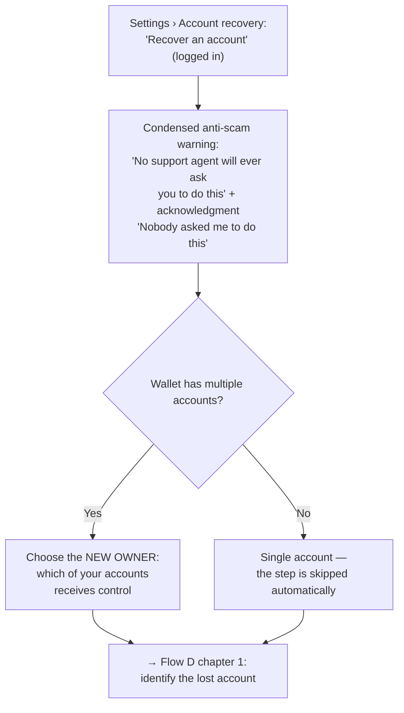

Decisions:
- ✅ Logged-in entry exists next to the fresh-install entry.
- ✅ Multiple accounts → the user picks which account becomes the new owner.
  A single account skips the step.
- ✅ The anti-scam warning also gates this entry (condensed): a support-scam script
  ("open Settings, click Recover") must hit the same warning as the fresh-install
  path.

### Interactive claim collection (refines Flow D chapter 2)

The checklist is interactive per method of the selected path.

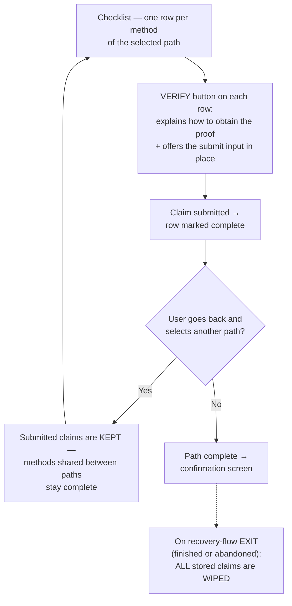

Decisions:
- ✅ Each method row has a **verify button**: it explains how to get the proof and
  gives the way to submit it, in place.
- ✅ Claims **survive path switching**: going back and selecting another policy keeps
  every claim already submitted.
- ✅ Claims are **wiped when the recovery flow exits** — finished or abandoned.
  Security rule: claims never persist beyond the flow.

---

## Flow D2 — Cancel side (original owner's device)

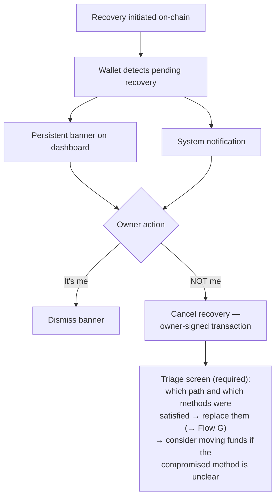

Decisions:
- ✅ Banner + notification. Polling caveat accepted for now (user must open the
  browser during the waiting period). Alerts opt-in in Flow C step 7 mitigates.
- ✅ Cancel is not resolution: the attacker still holds a working method. The triage
  screen is required, not optional.

---

## Flow E — Guardian approval

**E1 (sync) is the default for v1.** E2 (async) stays mapped as a future improvement.
Either way the recovery **trigger stays with one person** (the recoverer).

**Scope note (decided, Notion review):** the guardian approval page is an
**extension-specific implementation**, not part of the kit/SDK — the product is the
SDK; each wallet implements its own guardian-approval surface. Who hosts and
maintains the page — **decided (demo-review meeting, decision 51): the
extension-relative path ships first; IPFS/IPNS is the later upgrade.** The
relative-path MVP assumption (the guardian uses the same wallet) is accepted for
the starting point.

### Flow E1 — Sync (off-chain signature passing) — DEFAULT

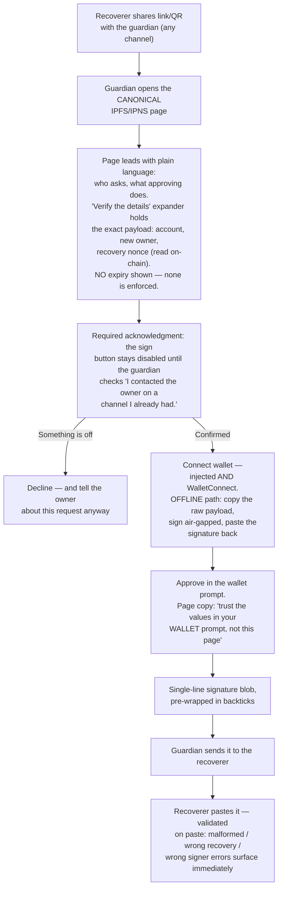

Security rationale (why these steps exist):
- Design principle for guardian-facing surfaces (decided): **"Information should be
  ignorable but verifiable."** Guardians can be non-technical users. Plain language
  leads; the technical detail collapses behind a "Verify the details" expander and
  never blocks the main path.
- The page renders whatever the URL says — an attacker who builds the link controls
  everything it displays. The page is **not** a trust anchor. The two real anchors
  are: the out-of-band call to the owner, and the wallet's own signing prompt.
- The acknowledgment checkbox is UI friction, not enforcement — a static page cannot
  verify that the call happened. It still forces a deliberate pause at the exact
  moment phishing relies on speed.
- Guardians who decline should still tell the owner: off-chain proof collection is
  invisible on-chain, so guardians are the owner's only tripwire during that phase.
- A guardian signature has **no expiry** — it dies only when its nonce is consumed or
  the request is cancelled. Never display a time limit the contract does not enforce.

### Flow E2 — Async (on-chain approval) — FUTURE

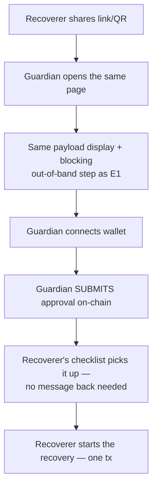

Blockers (secondary to this doc's focus; tracked for completeness): no on-chain
approval function exists in the current contracts (R5 conflict); guardian-side gas
needs sponsorship; detection needs indexing that the backend-zero design removed.

---

## Flow F — Health checks (optional capability)

Same machinery as the verify-access tests, run over time. **Optional capability,
not the v1 focus (decision 42)** — the flow stays mapped, but nothing else in this
document depends on it shipping.

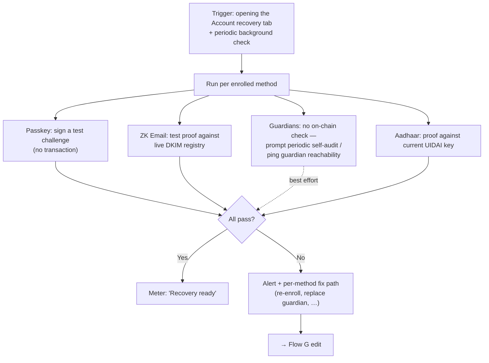

Decisions:
- ✅ Meter label is **"Recovery ready"**, not "Protected" — recovery protects against
  key **loss**, not key theft, and a single-passkey floor must not show the same
  confidence as a 2-of-3. The meter level still scales with path count/strength.

---

## Flow G — Recovery paths & method management

Lives in Settings › Account recovery (demo screens: `sr-policies`, `sr-policy-edit`).
All changes are owner-signed transactions (only the current owner can modify
configuration).

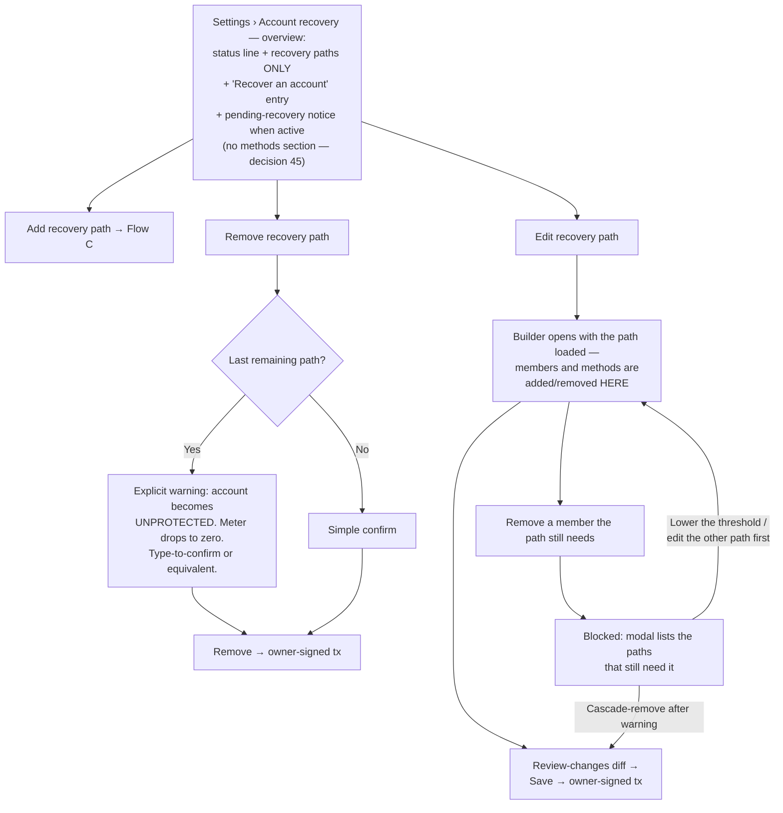

Notes:
- Config changes are allowed while a recovery is pending and do not affect the
  pending request. If a recovery is pending, the management screen says so next to
  every action.
- Guardian replacement is an Edit case; the health-check alert (Flow F) and the
  post-cancel triage (Flow D2) both deep-link here as the fix path.
- "Recover an account" is reachable from this overview too, not only from the
  fresh-install welcome.
- Methods have no top-level list or "remove method" entry (decision 45): every
  member/method change happens inside the path editor and ends in a review-changes
  diff before one owner-signed transaction. The method-in-use block fires from the
  editor, not from the overview.
- A deferred post-recovery cleanup (decision 46) surfaces here as a flagged banner
  ("a method from your last recovery is still flagged — replace it") until resolved.

---

## Decisions log

| # | Question | Answer |
|---|---|---|
| 1 | Account creation in recovery entry | Explicit step, fast-tracked (Flow A1) + warning screen. |
| 2 | Nudge trigger + re-nudge | Modal each open + "Don't remind me again" + passive shield badge. |
| 3 | Setup modes | Three: Express, Presets (landing state), Advanced. |
| 4 | Method set v1 | All 4. Aadhaar for everyone, listed last, badged. |
| 5 | Terminology | "Account recovery" / "recovery path" / "method" / "waiting period" in UI; spec terms in prose only. |
| 6 | Honest copy for floor cases | Yes — concrete copy in Flow B. 7702 vs 4337 deferred. |
| 7 | Gas for recovery | ⚠️ **Escalated to blocker**: paymaster can't sponsor direct calls; no relayer exists (backend-zero). |
| 8 | Identify lost account | Address / ENS / gated same-install list + confirm-identity card. |
| 9 | Guardian-side UX | Hardened IPFS/IPNS page (E1 default): real payload incl. nonce, no fake expiry, blocking out-of-band step, decline branch, offline signing. |
| 10 | Proof collection state | Local persistence, resumable, switch-path exit; atomic submission. |
| 11 | Pending-recovery alert | Banner + notification + alerts opt-in at setup. Polling caveat accepted. |
| 12 | Waiting period default | 48h flat, changeable. **Confirmed also for single-method paths.** Guardrails: minimum floor + dominated-path warning. |
| 13 | Multi-account | Offer "apply same setup" with R10 constraints (fresh accountCode auto; linkability warnings). Never by default. |
| 14 | Health checks | In scope → Flow F. Meter = "Recovery ready". **Downgraded to optional capability by #42.** |
| 15 | Chain scope | One chain per policy. Ethereum focus, Sepolia demo. Multichain out of scope v1. |
| 16 | ZK Email mechanics | **Narrowed by #55**: transport is local `.eml` proving, no relayer. Still open: subject/command format, accountCode storage, prover stack + latency. |
| 17 | Passkey on new device | Platform sync + WebAuthn hybrid. |
| 18 | Guardian page wallets | Injected + WalletConnect + offline signing path. |
| 19 | After waiting period | Notify + auto-execute — intended UX; **executor unresolved** (see #7). |
| 20 | Config survives rotation? | Assume yes → makes the end-of-recovery cleanup checklist REQUIRED. |
| 21 | Express presets | Owned by ottie's persona research. |
| 22 | Mixed-method OR-groups | **Decided — assumed valid** (PR #2 review); generalized by #41. Encoding confirmation with kit team (T10). |
| 23 | Guardian gas (E2) | Needs sponsorship; one of E2's three blockers. |
| 24 | Multichain | Out of scope v1. |
| 25 | Fast-track onboarding | Warning screen + password + key + seed backup. Corrected copy (address never changes). |
| 26 | Express wizard shape | Guided, short, inventory step; draft/resume; alerts opt-in. |
| 27 | Verify-access | Mandatory for identity methods; guardians optional, open. Mutual guardian approval = under consideration. **Guardian side confirmed optional by #52.** |
| 28 | Setup gas / batching | User pays if funded, else paymaster. Batching partially answered (thread T7: one batched UserOp — conceded, unwritten). |
| 29 | Config visibility | Structure readable; value visibility OPEN (guardian addresses natively public today); password-decrypt case stays. |
| 30 | R9 orthogonality gate | **Not now** — invariants/tech design under rework; violations allowed; revisit later. |
| 31 | Guardian mutual approval | Best-effort stands; mutual approval noted as a considered path. |
| 32 | Management flows | Mapped → Flow G. |
| 33 | User-facing name | "Account recovery". |
| 34 | Logged-in recovery entry | Settings button. Multiple accounts → choose the new owner; single account → step skipped. |
| 35 | Claim handling in the checklist | Per-method verify button (explain + submit in place). Claims survive path switching; wiped on flow exit. |
| 36 | Single-guardian setups | Supported: one guardian, 1-of-1 groups. No minimum guardian count (wireframe review). |
| 37 | Two-method inventories | Wizard recommends two single-method paths, not an AND pair. 48h default stays. |
| 38 | Passkey type | Detect synced vs device-bound (WebAuthn backup-eligibility flag); warnings adapt. |
| 39 | Self-held keys inventory | "Keys you keep yourself — paper or hardware" inventory item routes to guardian entry. |
| 40 | Logged-in entry warning | Condensed anti-scam warning + acknowledgment gates the Settings entry too. |
| 41 | ANY-of groups generalized | M-of-N threshold over any mixed members; guardians are ordinary members (no special threshold); free mix of required rows + groups per path; wizard "any M of N" → one path, one group. |
| 42 | Health checks priority | Optional capability, not the v1 focus (wireframe feedback). Flow F stays mapped; the meter is a status line, not a headline feature. Downgrades #14. |
| 43 | Guardian display | No guardian names anywhere: a guardian **is** an address. UI shows blockie + address (or ENS). The wallet stores no names or contact labels — nothing extra to leak. |
| 44 | Recovery-in-progress screen | Resuming an unfinished recovery lands on a dedicated "Recovery in progress" screen (account, per-row progress, resume / abandon) — the home-surface pending card is only the entry point. |
| 45 | Method management | Methods are managed **inside path editing** (edit path → review-changes diff → one owner-signed tx). The management overview lists paths only — no separate methods section or top-level "remove method". |
| 46 | Cleanup deferral | Deferring the post-recovery cleanup is allowed; it surfaces as a flagged banner state on the management overview until resolved — not a separate screen. |
| 47 | Dry run at setup | The wizard offers a local recovery rehearsal before the final save (demo-review meeting): complete each method's row as if the key were lost today. Optional, skippable; no chain interaction. |
| 48 | Recovery password setup | The password that encrypts recovery values is set in an explicit, skippable wizard step between waiting period and review (audit result; wireframe C-06e; same control on the Advanced builder). **The card hint is DROPPED** — audit risk: a hint can leak configuration and cannot be validated. Forget-protection is the dry-run recall row instead. |
| 49 | Single-method recommendation | Never force a second method. Recommend one — explicitly including "a second passkey from another device". Copy on the single-method wizard states. |
| 50 | Synced-passkey cleanup semantics | A synced passkey stays flagged after recovery while a lost device remains signed in to the platform account; the fix path includes revoking the device/passkey from the platform or password manager. Closes the v5 spec gap. |
| 51 | Guardian page hosting | **Relative (extension-served) path first; IPFS/IPNS later.** Simpler for integrators as a starting point. Closes the hosting item in the tech-dependencies table. |
| 52 | Guardian verification at setup | Confirmed optional (demo-review meeting) — no forced guardian signature during setup; reaffirms #27. |
| 53 | Metadata encryption options | Three candidates: encrypt nothing / policy only / policy + metadata. Choice sits with the kit team; the schema must be fixed once (versioning possible, one standard preferred). Q29 stays open; UX must follow the choice. |
| 54 | Verify-access scope | The wizard's identity-method tests stay mandatory and blocking (#27). The **Advanced builder offers tests without enforcing them** — a power user may save untested methods (wireframes C-10d/C-10e). |
| 55 | ZK Email transport direction | **Local, relayer-free**: the user sends the prepared email, downloads the raw `.eml` (Gmail: ⋮ → Show original → Download original), and the wallet verifies/proves from it on-device. Fits backend-zero. Open with the kit team: exact subject/command format, accountCode storage, in-extension proving latency (~15–60s). Redrawn in C-05e/D-07e; the 6-digit-code illustration is retired (it matched no real mechanic). |
| 56 | Recovery password lifecycle | Set once at setup; **no change or removal surface**. A forgotten password never blocks recovery — it only keeps values hidden (D-06e). The dry run's recall row is the forget-protection. Note: editing guardians re-encrypts under the same password. |
| 57 | Password naming | One name everywhere: **"extension password"** (the device-unlock password). "Full wallet password" is retired from all copy. The recovery password (decision 48) stays a distinct, clearly separated concept. |

---

## Tech dependencies — route to the kit team

| Item | Blocks | Ref |
|---|---|---|
| **Funding & execution**: who pays and who executes `initiate/executeRecovery` (bypass 4337; backend-zero = no relayer) | Flow D entirely; Decision 19 | Q7/19 |
| ZK Email — remaining after the .eml direction (decision 55): exact subject/command format; where the per-account `accountCode` lives without a backend; prover stack (circom WASM / halo2 / Noir) and whether ~15–60s in-extension proving is acceptable; DKIM registry choice (ZK Email's ICP-oracle default vs self-maintained ERC-7969); module timelock/expiry defaults vs our per-path waiting period | ZK Email sub-flows + verify-access | Q16/55 |
| Confirm the encoding for generic ANY-of groups — mixed member types, M-of-N thresholds (T10 `threshold` field) | Builder + presets + recovery checklist | Q22/41 |
| ZK Email `accountCode` derivation per account (R10 unlinkability requirement) | Multi-account apply | — |
| Exact guardian signed payload (nonce display; add `policyId`?; expiry — define or confirm none) | Flow E1 page | — |
| Policy value visibility (guardian addresses are natively public today — can values be hidden at all?) + password-encrypted values case | Flow D entry + path display | Q29 |
| R5 conflict (atomic vs incremental); E2 needs an approval function + indexing | Flow E2 | — |
| Setup batching: write T7's one-UserOp answer into the spec | Wizard step 6 | Q28 |
| Config survival after rotation (+ `onUninstall` nonce-reset issue) | Flow D end state | Q20 |
| Same-install account history lookup, gated | Flow D identify step | Q8 |
| Enforced minimum waiting period on-chain (zero-second currently legal) | Builder guardrails | — |
| Guardian approval-page hosting — **decided: relative path first, IPFS/IPNS later (decision 51)**; remaining question for the EF: long-term canonical hosting | Flow E1 | 51 |
