# Social Recovery — UX Flow Diagrams (working doc)

> Working document. Owner: Fibo. Status: **reviewed — 6-perspective review pass applied 2026-08-12; decisions 1–98 current, including the 2026-08-25 contracts-spec reconciliation round (decisions 90–96, REC items) and the 2026-08-25 final ruling batch (decisions 97–98: privacy levels assumed available, setup disclosures adopted)**. Sources: social-recovery prototype HTML (demo), the Notion [Personas page](https://app.notion.com/p/36d9a4c092c780578f9dde36e69dfff5) (Alice → Sam), Design Rationales R1–R13. Scope note: this document focuses on the **UX of the initiative**; contract-level details live in the tech design and are only referenced where a UX flow depends on them.
>
> Framing: the social recovery initiative is a **general-purpose improvement for the ecosystem**. This extension is the demo/reference app that shows what can be done. These flows are therefore **reference UX**, not app-only decisions. This document lives as a **sibling to the Notion pages** (personas, rationales).
>
> Naming (decided): the user-facing label is **"Account recovery"**. "Social Recovery (Kit)" stays as the internal/tech name only. User-facing vocabulary (decided): **"recovery path"** = one clause/card, **"method"** = one credential, **"waiting period"** = timelock. "Policy", "proof", "relayer", "EIP-712" stay in spec prose only.
>
> Context: the UX lives under **Settings › Account recovery**. The recovery module is ERC-7579, on a **4337 smart account** (decision 78 — the initiative focuses on 4337; 7702 support is deferred). Chain scope: **one chain per policy**; demo runs on **Sepolia**; focus is Ethereum. **Multichain: deferred, not decided** (their Q-15) — safety note for integrators (REC-5, corrected 2026-08-25): a recovery rotates the key **only on the chain it ran on**. On every other chain the same address is still controlled by the **old** key — it is not "locked". So a *lost* key leaves the other chains unrecoverable, and a *stolen* key **keeps full control** of the same address everywhere the recovery did not run. Any multichain answer must say this before it says anything else.

---

## Flow A — Extension first open (entry points)

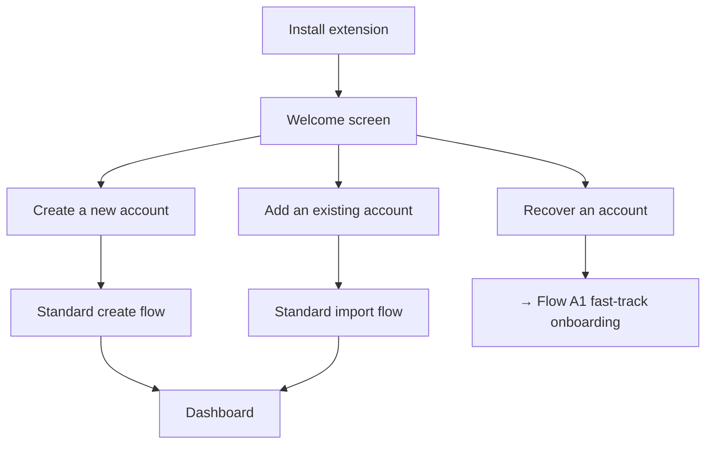

### Flow A1 — Fast-track onboarding (recovery-focused)

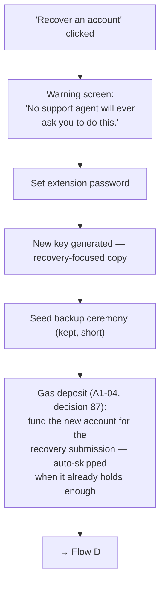

Decisions:
- ✅ Fast-track = **warning screen + extension password + key creation + seed backup + gas deposit** (87). Nothing else.
- ✅ Why a password inside a recovery flow: this IS the normal create-account flow, fast-forwarded — the recoverer may have never installed the extension before, so the extension password is set here like in any first run.
- ✅ The fast-track creates **just an EOA** — the key that becomes the **signer of the recovered account** (decision 88, amended in review). No smart account is deployed here: the recovered account already is one. It is the **standard create flow** where onboarding MUST deploy a smart account at initialization (today the app creates a bare EOA; that changes). The gas-deposit step joins the standard create flow too, skipped when the account is already funded.
- ✅ Seed backup is not deferred. It stays in the fast-track.
- ✅ Copy at key creation (corrected): "**Your account stays at the same address.** This new key will control it." (Nothing "moves"; the address never changes.)

---

## Flow B — Recovery-methods check + nudge

"Nudge" = the banner/tag that appears while one of your accounts has no recovery path set up — it nudges you into completing the setup.

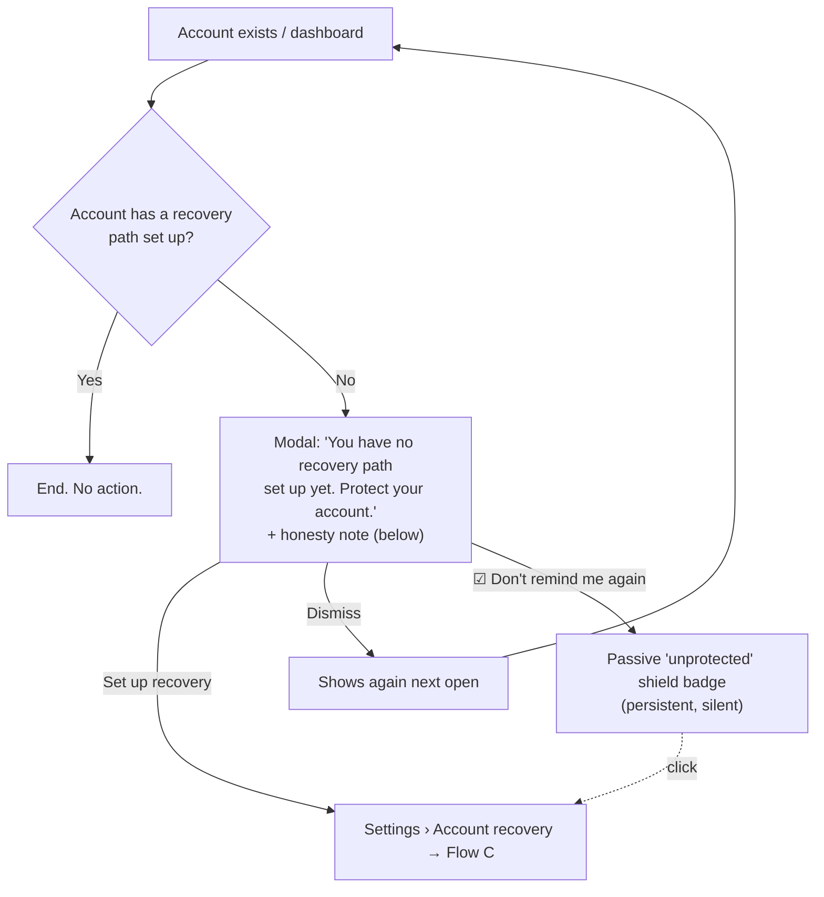

Decisions:
- ✅ Trigger: each dashboard open until the user acts or opts out.
- ✅ Permanent dismiss keeps the shield badge as re-entry point. Concretely: a small shield icon in a warning state, shown permanently on the account row and on the Settings › Account recovery entry while the account has no recovery path. It never pops up and never blocks anything. Clicking it opens setup (Flow C).
- ✅ Honesty note, concrete copy (reworded 2026-08-24 — the old wording read as if any passkey dies with the device): "Recovery protects you if you **lose** your key. It cannot stop someone who already has it." Passkey sentence by detected type — **device-bound** (created in a local keychain and not synced anywhere): "this passkey lives only on this device — losing the device also removes this recovery path"; **synced** (iCloud/Google/1Password and similar): "this passkey is synced — it survives losing this device, but it depends on that account". We detect the type at enrollment (decision 38) and always tell the user which one they have.

---

## Flow C — Recovery setup

Building blocks:
- **Methods (decision 80, 2026-08-20):** passkey, guardians (people's wallets, EOA or SCW), **zkPassport**, Anon Aadhaar. zkPassport's mechanics (what the user presents, proof budget, enrollment secret) need a research pass before the old email screens (C-05e/k/n, D-07e) are redrawn. History of the dropped ZK Email method lives in the decisions log only (16/55/77/80).
- **ONE recovery path per account (decision 73, 2026-08-18):** the OR-of-paths level is removed. An account has exactly one path: required method rows and ANY-of groups, all combined with AND. Examples: `passkey AND [2 of 3](G1, G2, zkpassport)` · `[2 of 3](G1, passkey, aadhaar)` · `passkey AND zkpassport` (both required). The UI keeps calling it the **"recovery path"**; the methods stay **"recovery methods"**.
- **ANY-of groups are generic (decided 2026-08-13):** a group's members can be ANY method instances — guardians, passkeys, zkPassport, Aadhaar — mixed freely. Guardians are not special: "3 of 5 guardians" is simply a group whose five members happen to be guardians. No guardian-specific threshold concept exists in the UX.
- **Every group carries an M-of-N threshold** ("Require 2 ▾ of: passkey, Ana, ID"), not only 1-of-N.
- **Wizard vs Advanced shape (decision 75):** the wizard builds required rows plus **at most one** ANY-of group over the methods the user selects. Multiple groups in one path (`passkey AND [2/3 guardians] AND [1/2 IDs]`) exist only in the Advanced builder.
- **Instance uniqueness (decision 76, scoped by decision 93):** one enrolled method instance (a specific passkey, guardian address, or passport) appears **once** across the whole path — never both as a required row and as a group member. Method *types* may repeat with different values (two guardian methods with different addresses is fine). This is a **wallet-side policy, not a contract rule**: their contract deliberately allows naming the same person twice, so the block lives in our builder and the copy must not claim the chain rejects it.
- **A single method is a valid path** (Sam's floor). The builder must support one-method paths; the honesty note (Flow B copy) doubles as their warning.
- **Recoverer side:** the recovery checklist renders the path as required rows plus group headers with progress ("any M of N — 1 of 2 done"); the path completes when every required row and every group threshold is met. There is no path choice.
- Contract encoding for generic M-of-N groups sits with the kit team (tech-dependencies table; T10 `threshold` field).

### Three setup modes

| Mode | For | Shape |
|---|---|---|
| **Express** | Least technical | Short guided wizard. Per-step education, minimal UI. |
| **Presets** | Middle ground | Pre-defined path shapes; the user picks ONE, then edits it. A fourth **"Start from scratch"** card opens the same editor empty (decision 82). |
| **Advanced** | Most technical | Free builder (grouped condition pattern). |

**Entry pattern:** no three-way fork. The tab **lands on the Presets state**; two actions on top: **"Guide me"** (Express) and **"Customize"**. A fourth card in the preset grid, **"Start from scratch"** (decision 82), opens the editor empty — so a power user never has to adopt a preset and edit it down. Milestone wiring: in the MVP "Customize" opens that same blank editor; when the Advanced builder ships (V1) "Customize" points there and the card stays as the middle option.

**Starter presets (single-path model, decision 75): three path SHAPES to choose from** — the user picks one, and it becomes the account's single recovery path (48h waiting period, "needs setup" state, deep-links into enrollment):
1. **"Your device + your guardians"** — `passkey (required) AND [2 of 3](guardians)`.
2. **Your device + your ID** — `passkey AND zkpassport`, both required, with the "Deliberately strict — both must answer" line. Preset name and copy to be finalized with the zkPassport research. **Kept as-is by decision 94** even though the contracts team's tiering discourages this shape — our presets take precedence over their weighting.
3. **"Guardians only"** — `[2 of 3](guardians)`, no device or platform dependency (the Alice/paper-guardian profile; the only preset with no passkey).

Group thresholds adapt to the member count the user actually enrolls; 2-of-3 is the starting suggestion.

### Express wizard — step list

```mermaid
flowchart TD
    A[Express start] --> B["1 · How recovery works —<br/>one screen, three bullets"]
    B --> C["2 · Inventory: what do you have?<br/>(checkbox list below)"]
    C --> D["3 · Recommended path shown as<br/>ONE card: required rows + one<br/>ANY-of group over the selection<br/>(shapes from ottie's persona research)"]
    D --> E["4 · Enroll each method:<br/>short explainer + 'Learn more' +<br/>mandatory access test (local, no chain)"]
    E --> F["5 · Waiting period — 48h default,<br/>changeable down to INSTANT (0h).<br/>The picker warns that 0h removes<br/>the cancel window (decision 85)"]
    F --> PW["5b · Recovery password — REQUIRED at the two<br/>hidden levels, ABSENT at Public (decision 90).<br/>Password + Confirm password (decision 95).<br/>It encrypts the recovery config values<br/>(commit-reveal, decision 84) and carries the<br/>visibility choice: Hide everything /<br/>Hide the details (default) / Public<br/>(Public = no password is set)"]
    PW --> G["6 · Review → optional DRY RUN (ships V1):<br/>a local rehearsal of the recovery —<br/>complete each method row as if the key<br/>were lost today (decision 47)<br/>→ submit config (one confirmation, Q28)"]
    G --> H["7 · Recovery Card download<br/>+ enable alerts opt-in"]
    H --> I["8 · Offer: apply to other accounts<br/>(never by default; see R10 constraints)"]
```

Inventory items (step 2):
- ☐ another device (passkey-capable)
- ☐ trusted contacts with wallets
- ☐ a passport (zkPassport — details pending its research pass)
- ☐ Aadhaar ID (last, badged)
- ☐ keys you keep yourself — paper or hardware (routes to guardian-address entry)

The recommended presets in step 3 come from the [persona research (Notion)](https://app.notion.com/p/36d9a4c092c780578f9dde36e69dfff5).

Wizard state rules:
- ✅ **Draft/resume:** progress persists locally; abandoning mid-wizard re-enters at the last completed step. Enrollments without a saved on-chain config show as "not yet active".
- ✅ **Alerts opt-in (step 7):** request notification permission here — Flow D2 depends on it. If denied: degraded banner-only behavior, stated to the user.

### Verify-access at enrollment

Mandatory for identity methods; a failing test blocks the save. Local only, no chain.

| Method | Test |
|---|---|
| Passkey | Sign a test challenge right after creation. Instant. |
| **zkPassport** (replaces ZK Email, decision 80) | Test flow TBD from the research pass — presumably: present the document → local proof → verify against the on-chain verifier. Progress UI; doubles as dry run. |
| Anon Aadhaar | Test proof against the current UIDAI key. |
| Guardians | **Optional, open**: light checks (checksum, ENS resolution, contract detection, same-seed). A real signature test needs the guardian to act — also optional. |

**ID-method enrollment — identity is not presence (C-05 zkPassport and Anon Aadhaar rows, disclosure #4, decision 98, MVP copy):** an ID proof shows **what the document says**, not that the person holding it acted just now. Copy on both enrollment screens: "This proves the details on your document. It does not prove that **you** are the one using it right now." The point is the limit of what the method buys: a document proof is a strong link to an identity and a **weak** statement about presence, so a path that leans on one ID alone leans on that gap. The same sentence repeats, short, on the C-07 review row for each ID method — the review is the last place the user can still change the shape.

**Guardian enrollment — publication disclosure (C-05, REC-17, MVP copy):** "If this account is ever recovered, every credential the recovery uses is published in the clear on-chain. A guardian who approves has their address recorded publicly and permanently. Ask the person before you name them." Enrolling a guardian never publishes anything by itself; the publication happens at submission, and this line is where the user learns it in advance.

### Recovery password step (C-06e)

- **Required at the hidden levels (decision 90, amends 48):** the password step is **mandatory** when the user picks **Hide everything** or **Hide the details**, and **absent** at **Public** (nothing is encrypted, so there is nothing to set — decision 84). It is no longer a skippable step.
- **Password + Confirm password (decision 95, REC-38):** the step carries both fields. There is **no dry-run password-recall test in the MVP**; the full dry run stays V1 (decision 47), so confirm-on-entry is the only forget-protection the MVP ships.
- **Honest consequence, stated on the step (decision 90 — this line IS setup disclosure #6, "the backup trade", decision 98/REC-35, MVP):** the recovery password is **printed on the Recovery Card**. Anyone holding the card can therefore decrypt and **read** the configuration values — they still cannot recover, because the recovery path itself must be satisfied. But if the card **and** the password are both lost at a hidden level, a fresh device **cannot begin a recovery at all**. Copy must say both halves. Disclosure #6 is **already carried by this line** — tag it, align its wording, and do **not** add a second backup-trade paragraph to the step.
- **Per-level reveal lines on the visibility radio (disclosure #5, decision 98, MVP copy):** each of the three options carries **one line saying what that level lets a stranger see**, rendered under the option label, not in a help sheet. **Hide everything** — "nobody can see that this account has a recovery setup, or what is in it. A fresh device shows nothing until you enter this password." **Hide the details** (default) — "anyone can see the SHAPE of your setup — that it takes a passkey and two of three people — but not which passkey or which people. A fresh device shows the shape without the password." **Public** — "anyone can read the whole setup: every method, every guardian address, every threshold. No recovery password is set." The three lines are the user's only view of the trade, so they must state the reveal, not the reassurance.
- **Public level:** no password field renders, and the step becomes a visibility choice only.

### Waiting period & repayment (C-06)

- **Repayment row (REC-36, V1):** bounded repayment (what the account pays back to whoever submits) sits **inside the setup body**, so it is hashed into the digest guardians sign. It gets its own read-only row near the waiting-period step, and it must **also** appear on every guardian payload surface (E1 and the D-07 manual row) — a guardian signs it whether or not we show it.

### Review & trust list (C-07)

- **Trust-root declaration (REC-13, MVP copy):** the review step lists the modules and adapters the path depends on. A module that ships **without a trust-root declaration** is shown as carrying **"unknown outside parties"** (their I-4) — not as "unpinned code". The user is told plainly that we cannot name who they are trusting.
- **Dead-provider disclosure, hardened (REC-13, MVP copy):** methods and adapters ship **immutable**. If a provider behind a method stops working, that method is **permanently** dead — the lockout is not temporary, and it is only survivable if the path has redundancy that does not depend on the same provider. Never write "temporarily unavailable" for an immutable method.
- **Publication disclosure (REC-17, MVP copy):** the review step repeats that a future recovery publishes each used credential's cleartext in calldata, so guardian addresses become permanently public on-chain.
- **Repayment (REC-36, V1):** one line on the trust list stating the bounded repayment the account owes a submitter, because it is part of what guardians sign.
- **Extra doors (REC-34, V1 — this is setup disclosure #7, decision 98):** an enumeration step/disclosure — authorities that exist **outside** the recovery module (other owners, session keys, other installed modules) are **the holder's to enumerate**, and their I-17 puts the duty on us to say so. We list what we can see and state plainly that we cannot see everything.
- **Identity ≠ presence, repeated per ID row (disclosure #4, decision 98, MVP copy):** every zkPassport or Anon Aadhaar row on the review carries the short form of the C-05 line — "proves what your document says, not that you acted just now". The review is the last screen where the user can still change the shape, so the limit is stated there again, not only at enrollment.
- **Graded fragility disclosures #1/#2/#3 (decision 98, V1 — with the grading work of decision 86):** three Q-8 disclosures land on this section as **graded** copy once fragility grading exists. **#1 single point of failure** — a path that one lost thing kills. **#2 shared failure** — methods that die together (two passkeys in one platform account; guardians who are all one household; two ID methods behind one provider). **#3 adopt-at-your-own-risk** — a module that ships **without a trust-root declaration** is adopted on the holder's own judgement, because nobody can name who is being trusted. **Parts of #1 and #2 ship today and stay:** the Flow B honesty note, the single-method warnings (decision 49), the device-bound-vs-synced passkey copy (decision 38) and the dead-provider line above already say pieces of this in flat, ungraded language. What waits for V1 is the **graded** treatment — the per-path verdict that says how fragile THIS shape is and why — not the existence of the warning.

### Recovery Card (step 7)

Contents — **only**: the account address, **the recovery password** (decision 90, 2026-08-25), a short "how to start recovery" guide, and the canonical approval-page URL. Plus the line "this card alone cannot move funds." The old password-*hint* idea is moot: the card carries the real password now, so there is nothing to hint at. The account address on the card is also the answer to fresh-device account discovery (REC-31, Flow D chapter 1).

**Honesty consequences of printing the password (decision 90):** anyone who holds the card can **decrypt and read** the configuration values — which methods, which guardians, which thresholds. They still **cannot recover**: the recovery path itself must be satisfied, and reading the configuration does not satisfy it. The card's storage advice hardens accordingly — it is no longer a "store it insecurely" artefact at the hidden levels. And the residual risk is stated on the card and on C-06e: lose **both** the card and the password at a hidden level, and a fresh device **cannot begin a recovery**.

Explicitly **kept off the card** (decided, with rationale): the method inventory, guardian addresses, thresholds, and waiting-period values. (Guardian *names* do not exist anywhere — decision 43: a guardian is an address, shown as blockie + address or ENS; the wallet stores no contact labels.) Reason: a stolen or copied card must not become a **map of exactly which methods to phish**. The address alone is public information anyway; the configuration is the secret. **Amended by decision 90:** the card no longer targets insecure storage — it carries the password that unlocks the configuration, so a thief who holds the card can read that map from the encrypted log. Keeping the inventory off the card still helps (it costs the thief a lookup and keeps a *photographed* card less useful), but the card's own copy must ask for real storage care.

### Multi-account "apply this setup" (R10 constraints)

- Per-account unlinkability of the ID method (zkPassport nullifier scheme, was ZK Email's `accountCode`): **open question** (tech-dependencies table).
- ✅ **Cross-account linkability is conditional (decision 92, 2026-08-25 — replaces the old flat "reuse is observable on-chain" line).** Reusing the same passkey or the same guardian across accounts is **invisible at rest ONLY if the SDK mints fresh per-account salts**. Their R-16 attack: under salt reuse, recovering one account **unmasks the other account's setup** — the commitment is recomputable across accounts. So the SDK duty (per-account, per-credential salt minting) is what makes reuse safe, and the UX must not promise privacy the salts do not deliver.
- ✅ **The linkability warning moves to the submission/approval moment (decision 92).** It leaves C-09 (setup), where nothing is revealed yet, and lands where the reveal actually happens: the submit confirmation (D-11) and the guardian approval surfaces (E1, the D-07 manual row). Copy: "Submitting this recovery publishes the credentials it uses. Anyone can then see that the same passkey/guardian also protects your other accounts." The "create a fresh passkey for this account" offer stays at setup as the mitigation, without the false claim that reuse is already public.
- Never applied by default.

Other decisions:
- ✅ All 4 methods in v1. Aadhaar for everyone, listed last, badged.
- ✅ **Our presets take precedence over their tiering (decision 94, 2026-08-25).** We do **not** adopt the contracts team's primary/secondary method weighting: it is a verdict on rule quality, which is wallet-side by decision 81(a). Preset 2 (`passkey AND zkPassport`) stays. The method set stays passkey + guardians + Anon Aadhaar + zkPassport — reaffirming decisions 79 and 80 — and we keep assuming Anon Aadhaar works (SDK assumption A2), so their Q-7 contingency does not change our count.
- ✅ Two-method inventories (e.g. passkey + ID only) get **one [1 of 2] ANY-of group** recommended, not an AND pair — lockout is the larger risk at that level (Diana's shape; supersedes the old two-single-method-paths rule, decision 75). The waiting period stays the flat 48h default.
- ✅ Passkey enrollment detects **synced vs device-bound** (WebAuthn backup-eligibility flag). Warnings and floor copy adapt to the type: device-bound → "losing the device removes this path"; synced → "this path depends on your Apple/Google account".
- ✅ Waiting period (decision 74): **one per account** — the path's waiting period. 48h default, changeable. No enforced floor (decision 85): the picker allows **Instant (0h)** with a warning on the picker only — 0h removes the cancel window. The dominated-path warning is retired — with a single path, path domination cannot exist.
- ✅ Express presets and their contents come from **ottie's persona research**.
- ✅ Wizard "any M of your N methods" recommendations generate **one M-of-N group** inside the single path — not pairwise expansions. Required rows plus multiple groups exist only in the Advanced builder (decision 75).

### UI pattern references (solved problem)

Grouped condition builder with "ALL of / ANY of" headers: Notion/Airtable advanced filters, Apple Smart Playlists, Zapier paths, Stripe Radar, `react-querybuilder`. Threshold selector inside a group: Safe's "M out of N owners" row.

---

## Flow D — Recover an account

Preconditions — a key that will receive control, from either entry point:
- fresh install → the fast-track onboarding creates it (Flow A1);
- **logged-in** → an existing account is the new owner (see "Flow D additions" below). **Funding (decision 87):** MVP is user-funded — the new key covers gas, filled by the gas-deposit screens (A1-04 at onboarding, D-09 before submitting; both auto-skipped when the account already holds enough). Contract-side support: `execute` reimburses `msg.sender` directly (per the kit team — mechanic may still change). Paymaster sponsorship is V1, and who operates that paymaster is still open (tech-deps).

**Config visibility (ANSWERED — decision 84, commit-reveal):** the config is not natively public. Values live in **encrypted logs**, decrypted with the recovery password; the user decides what to expose. The kit offers three hiding levels and **we expose the choice** on the recovery-password step (C-06e): **Hide everything** (methods + metadata) · **Hide the details** (metadata only — the shape, e.g. "passkey + ID", stays readable; the default) · **Public** (nothing hidden — and **no recovery password is set at all**: nothing is encrypted, so there is nothing to enter later). The recoverer enters the recovery password to reveal what was hidden (e.g. which guardians to contact). **All three levels are ASSUMED available (decision 97, 2026-08-25):** "Hide the details" has no counterpart in the kit's current model, so kit-ask REC-24 carries the confirmation — the default and the dial stay as drawn.

**D-06e copy, corrected (decisions 90 + 56 amended, 2026-08-25 — the old line "you can still recover, the values just stay hidden" was wrong at the hidden levels):** the recovery password is **printed on the Recovery Card**, so the normal answer to "I forgot it" is "read it off your card". The honest residual is narrower and harder: at a hidden level, if the user has lost **both** the card **and** the password, a fresh device **cannot begin a recovery** — there is nothing to decrypt the configuration with. D-06e must say that instead of implying recovery always continues. At **Public** there is no password at all, so the question never arises.

**The D-04/D-06 readout is TWO-STATE (decision 97, REC-25 — resolved 2026-08-25):** the level the user picked at setup decides what a fresh device can show **before** any password is entered. At **"Hide the details"** and at **"Public"** the **structure** — THE path, its required rows and its group thresholds — renders straight from the **setup-event data, with no password at all**; only the **values** (which guardians, which passkey, which document) stay masked, and the card password unlocks them. At **"Hide everything"** **nothing** renders first: the entry is a locked state whose copy is **"we cannot show your setup yet — enter the recovery password from your card"**. Two consequences for the screens: the masked-values state must look like a *deliberate* mask (16 dots + `hidden` chip, decision 69), never like a load failure; and the locked state must never be drawn as an empty path or a "no recovery set up" result — the account IS configured, we simply cannot read it yet. Both states keep decision 90's honesty: a lost card plus a forgotten password at a hidden level is a **blocker**, not a degrade.

The flow is chaptered into its three phases so each diagram stays readable.

**Chapter 1 — Identify the account**

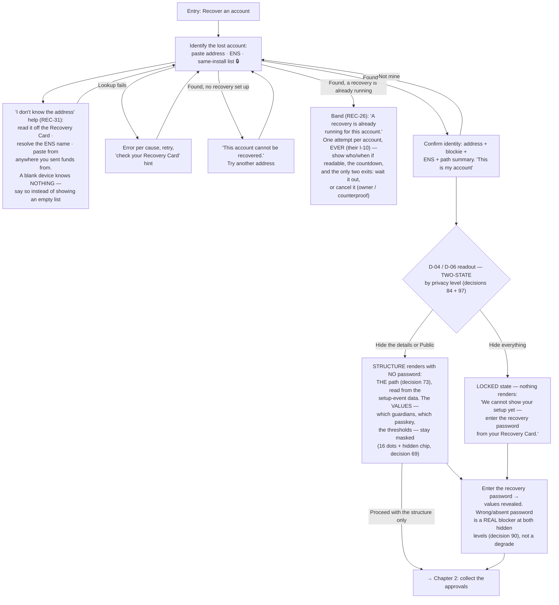

**Chapter 2 — Collect the approvals**

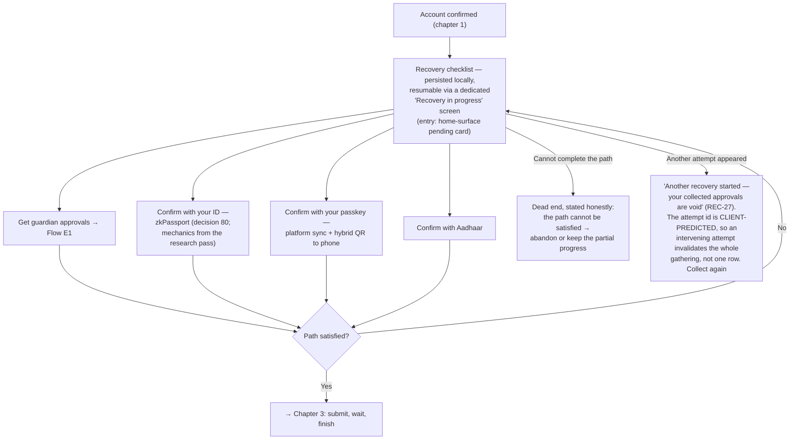

**Chapter 3 — Submit, wait, finish**

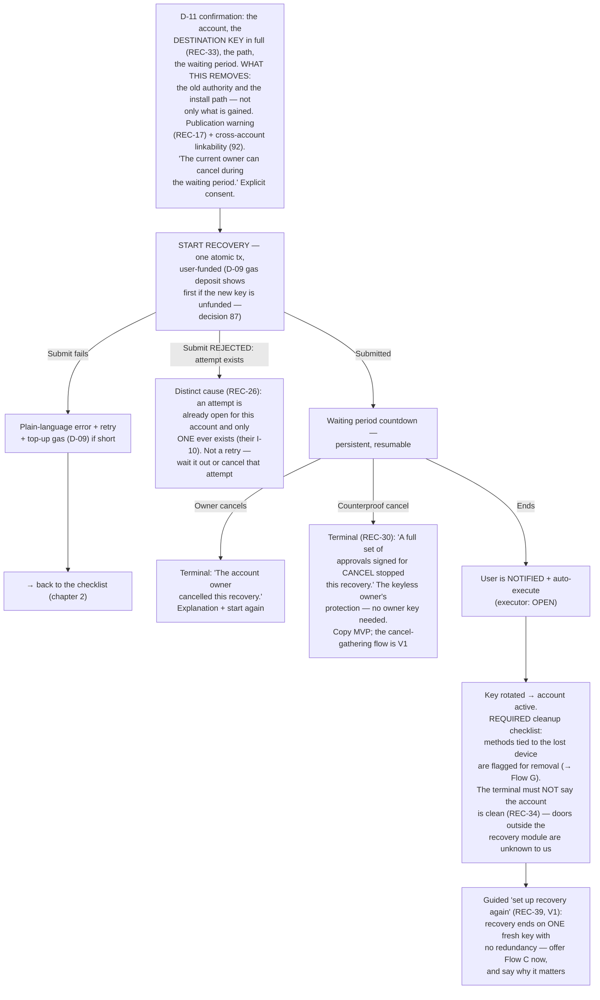

Decisions:
- ✅ Identify by pasted address, ENS, or the gated same-install list (full wallet-unlock strength, no balances shown, usage logged).
- ✅ Confirm-identity card before any proof collection (restored from the demo).
- ✅ There is no path choice and no "switch path" exit (single-path model, decision 73). If the path cannot be satisfied, the checklist says so honestly; partial progress persists until the flow exits.
- ✅ Resuming an unfinished recovery lands on a dedicated **"Recovery in progress"** screen — the account being recovered, per-row progress, resume and abandon actions. The home-surface pending card is only the entry point (decision 44).
- ✅ Submit failures get plain-language errors, retry, and a top-up-gas path (D-09 — user-funded is the MVP norm, decision 87).
- ✅ The countdown has a **cancelled** terminal state — the recoverer never waits into silence.
- ✅ End of recovery = **required cleanup checklist**, not a soft nudge: the surviving config still contains the lost device's methods; whoever holds that device can start a new recovery. Flag and walk through their removal. Deferring is allowed, but the deferral surfaces as a flagged banner on the management overview until resolved (decision 46) — it is a state, not a separate screen.
- ✅ Synced passkeys are flagged too (decision 50): while a lost device stays signed in to the platform account, it can still use the synced passkey. The fix path says so: revoke the device or the passkey from the platform / password manager, add a fresh one first, then remove the flagged method.

Reconciliation states (decision 96, 2026-08-25):
- ✅ **Fresh-device account discovery (REC-31, MVP).** A blank device knows nothing about the user. Chapter 1's entry carries explicit help: the **account address is printed on the Recovery Card**; an ENS name resolves to it; or paste it from any explorer or wallet the user sent funds from. Never render an empty same-install list as if it were the answer.
- ✅ **"A recovery is already running for this account" (REC-26, MVP).** Their I-10 allows **one attempt per account, ever**. Chapter 1 shows a band when the lookup finds an open attempt, and submission has a **distinct rejected cause** for it — not folded into the generic submit-failure retry, because retrying cannot help. The two exits are: let it finish, or cancel it.
- ✅ **"Another recovery started — your collected approvals are void" (REC-27, MVP copy).** The attempt id is **client-predicted**, so an attempt opened by anyone else in the meantime invalidates the **entire** gathering, not a single row. The checklist must say the whole set died and why, then offer to collect again.
- ✅ **Destination key and "what this removes" (REC-33, MVP copy).** D-11, E1 and the D-07 manual row all render the **destination key in full** plus what the recovery **takes away** — the old authority and the install path — not only the new control it grants. Their spec makes this an integrator obligation: "an integrator that renders a blind hash lets a phisher name their own key."
- ✅ **Counterproof cancel (REC-30).** A full proof set signed for **CANCEL** cancels the attempt. This is the protection for an owner who has **no key left** — it needs no owner signature. **MVP states it in copy** (on the D2 banner, the countdown and the cancelled terminal). The actual cancel-gathering flow — a mirror of the D-07 checklist, a CANCEL variant of E1, and a keyless entry point — is **V1**.
- ✅ **The post-recovery terminal cannot claim the account is clean (REC-34, V1 with the cleanup).** Authorities outside the recovery module are the holder's to enumerate (their I-17). The terminal lists what we removed and states plainly that other doors may exist.
- ✅ **Guided re-setup after recovery (REC-39, V1).** A completed recovery ends on a **single fresh key with no redundancy** — the least protected the account has ever been. Offer "set up recovery again" (Flow C) from the done terminal, with that reason stated. Preferred over an atomic contract feature; tell the contracts team so.
- ✅ **Post-recovery re-salting (REC-37, V2, with D-15).** The cleanup checklist gains a re-salting row: after a recovery the credentials used are public, so the surviving setup should be re-committed under **fresh per-account, per-credential salts** (decision 92's condition). Without it, the account keeps the linkability the recovery just created.

## Flow D additions — logged-in entry & interactive claims

### Logged-in entry (Settings)

Recovery does not require a fresh install. A logged-in user starts it from the **"Recover an account"** button on the Settings › Account recovery overview (Flow G).

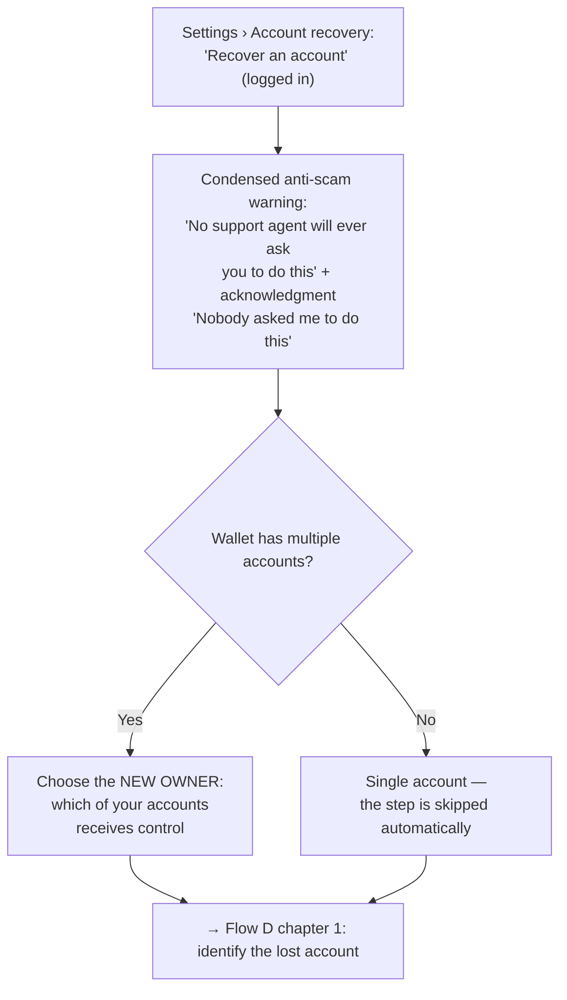

Decisions:
- ✅ Logged-in entry exists next to the fresh-install entry.
- ✅ Existing account as the new owner (decision 88): no smart account is created in the recovery flow — the chosen account's key simply becomes a signer of the recovered account too. The UI must say so: "after recovery, this account's key controls two accounts". Nothing merges.
- ✅ Multiple accounts → the user picks which account becomes the new owner. A single account skips the step.
- ✅ The anti-scam warning also gates this entry (condensed): a support-scam script ("open Settings, click Recover") must hit the same warning as the fresh-install path.
- ✅ **Migrate-assets state (REC-40, V1).** The existing-account route has a second shape the contracts team names: a **fresh smart account with the assets migrated across**, instead of one key controlling two accounts. It needs its own state — pick the destination, review what moves, and a per-asset progress readout with a resumable partial-migration state. Copy must keep decision 88's distinction: *controlling two accounts* moves nothing; *migrating* moves everything and costs gas per asset.

### Interactive claim collection (refines Flow D chapter 2)

The checklist is interactive per method of the path.

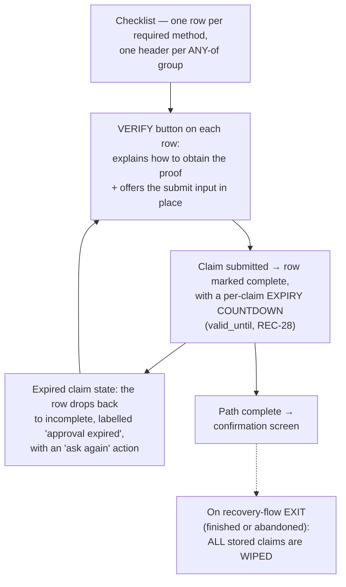

Decisions:
- ✅ Each method row has a **verify button**: it explains how to get the proof and gives the way to submit it, in place.
- ✅ Claims **survive pauses and resumes** on this device, **but they may expire** (decision 91, amends decision 70). A resumed recovery **re-checks every stored claim's validity** before showing progress, and surfaces the expired ones instead of counting them as done. (Path switching no longer exists — single-path model, decision 73.)
- ✅ **Per-claim expiry UI (REC-28, MVP).** Every completed row shows a countdown to its `valid_until`. When it passes, the row enters an explicit **"approval expired"** state — not a silent revert — and offers **"ask again"**, which re-opens the same verify affordance for that method. The checklist headline count excludes expired rows.
- ✅ **The D-07 manual guardian row carries three disclosures** beside the payload: the **destination key in full and what the recovery removes** (REC-33, MVP copy); the **publication warning** — "submitting this recovery writes each used credential's cleartext into calldata, so an approving guardian's address becomes permanently public on-chain" (REC-17, MVP copy); and the **bounded repayment** that is hashed into the digest being signed (REC-36, V1).
- ✅ Claims are **wiped when the recovery flow exits** — finished or abandoned. Security rule: claims never persist beyond the flow.

---

## Flow D2 — Cancel side (original owner's device)

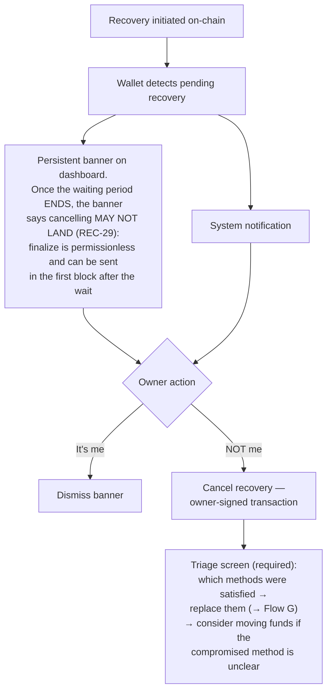

Decisions:
- ✅ Banner + notification. Polling caveat accepted for now (user must open the browser during the waiting period). Alerts opt-in in Flow C step 7 mitigates.
- ✅ Cancel is not resolution: the attacker still holds a working method. The triage screen is required, not optional.
- ✅ **"Waiting period ended — cancelling may not land" (REC-29, MVP copy).** The banner changes state the moment the wait expires. Finalize is **permissionless** and can be sent in the very first block after the wait, so a cancel submitted from that point on is a race the owner can lose. Say so before the user signs, and never show a cancel button that implies certainty.
- ✅ **Three routes cancel a running recovery, not one (REC-6, their I-12).** Beside the explicit **owner cancel** on this screen, two **side effects** cancel it too: **editing the recovery setup** (Flow G, G-05 save) and **uninstalling the recovery module**. Both are owner-signed acts that happen to kill the pending attempt. The banner and the triage copy name all three, so an owner who "just fixed the guardian list" is not surprised by what it did.
- ✅ **Counterproof cancel (REC-30, MVP copy).** An owner with **no key left** is not helpless: a full set of approvals signed for **CANCEL** cancels the attempt. The banner states it as the keyless route; the gathering flow itself is V1.

---

## Flow E — Guardian approval

**E1 (sync) is the default for v1.** E2 (async) stays mapped as a future improvement. Either way the recovery **trigger stays with one person** (the recoverer).

**Scope note (decided, Notion review):** the guardian approval page is an **extension-specific implementation**, not part of the kit/SDK — the product is the SDK; each wallet implements its own guardian-approval surface. Who hosts and maintains the page — **decided (demo-review meeting, decision 51): the extension-relative path ships first; IPFS/IPNS is the later upgrade.** The relative-path MVP assumption (the guardian uses the same wallet) is accepted for the starting point.

### Flow E1 — Sync (off-chain signature passing) — DEFAULT

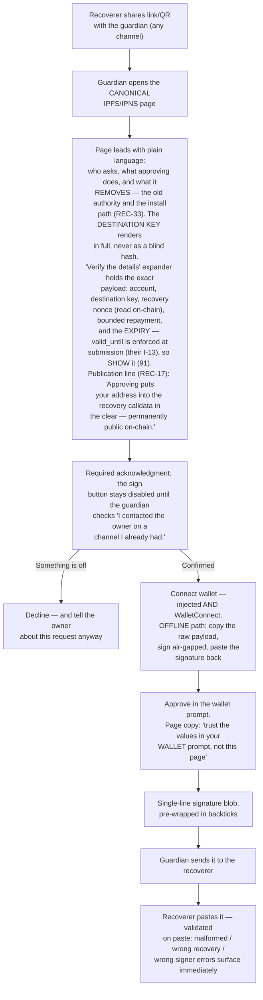

Security rationale (why these steps exist):
- Design principle for guardian-facing surfaces (decided): **"Information should be ignorable but verifiable."** Guardians can be non-technical users. Plain language leads; the technical detail collapses behind a "Verify the details" expander and never blocks the main path.
- The page renders whatever the URL says — an attacker who builds the link controls everything it displays. The page is **not** a trust anchor. The two real anchors are: the out-of-band call to the owner, and the wallet's own signing prompt.
- The acknowledgment checkbox is UI friction, not enforcement — a static page cannot verify that the call happened. It still forces a deliberate pause at the exact moment phishing relies on speed.
- Guardians who decline should still tell the owner: off-chain proof collection is invisible on-chain, so guardians are the owner's only tripwire during that phase.
- **A guardian approval DOES expire (decision 91, 2026-08-25 — this bullet said the opposite and was wrong).** `valid_until` is one of the eleven digest fields, and their invariant **I-13 rejects any stale proof at the door** — a submission carrying an expired approval fails. So an approval dies in **three** ways: its **expiry** passes, its **nonce is consumed**, or the request is **cancelled**. The page **shows** the expiry, as a plain deadline plus a countdown, because it is a real limit and a guardian who signs near the edge should know the recoverer has to submit before it lapses.
- **Publication is permanent and the guardian must be told before signing (REC-17, MVP copy).** Submitting a recovery writes every used credential's **cleartext into calldata**, so an approving guardian's **address becomes permanently public on-chain**. This line sits in the plain-language lead, not only in the expander — it is the one consequence a guardian cannot undo.
- **Show the destination key and what the recovery removes (REC-33, MVP copy).** Their spec puts this on the integrator: "an integrator that renders a blind hash lets a phisher name their own key." The page states what the approval **grants** (control to this exact key) and what it **takes away** (the old authority and the install path).
- **Bounded repayment on the payload surface (REC-36, V1).** Repayment lives inside `setup_body`, which is hashed into the digest the guardian signs. A guardian therefore signs it whether or not we render it — so render it.

### Flow E2 — Async (on-chain approval) — SKIPPED (decision 89)

Skipped for now (PR #2 review): on-chain approvals would be a big redesign of the recovery contract. Noted alternatives if it ever returns: emit the signature as an event (cheap contract change), or an offchain approval server that any consuming wallet runs itself. The mapping below stays for reference only.

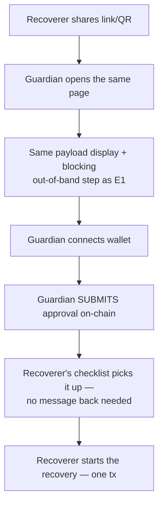

Blockers (secondary to this doc's focus; tracked for completeness): no on-chain approval function exists in the current contracts (R5 conflict); guardian-side gas needs sponsorship; detection needs indexing that the backend-zero design removed.

---

## Flow F — Health checks (optional capability)

Same machinery as the verify-access tests, run over time. **Optional capability, not the v1 focus (decision 42)** — the flow stays mapped, but nothing else in this document depends on it shipping.

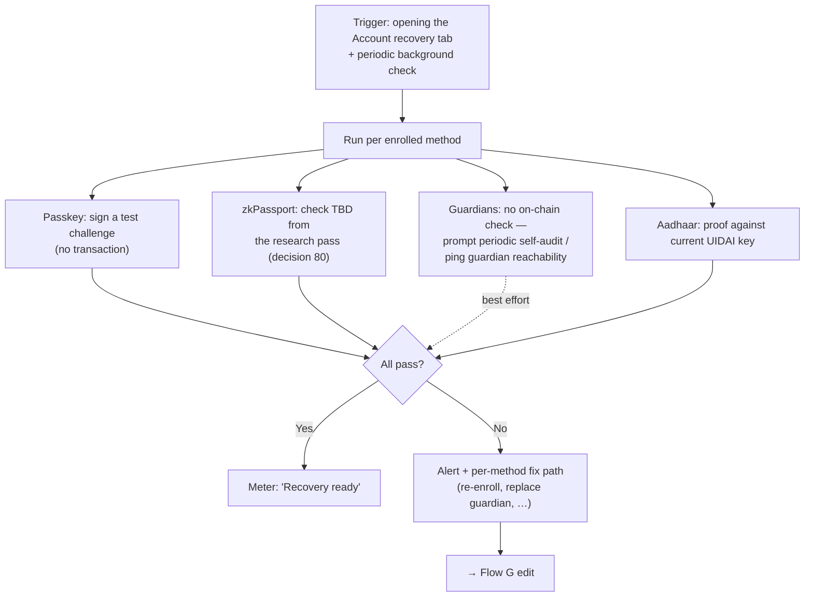

Decisions:
- ✅ Meter label is **"Recovery ready"**, not "Protected" — recovery protects against key **loss**, not key theft, and a single-passkey floor must not show the same confidence as a 2-of-3. The meter level scales with the path's strength.

---

## Flow G — Recovery path & method management

Lives in Settings › Account recovery (demo screens: `sr-policies`, `sr-policy-edit`). All changes are owner-signed transactions (only the current owner can modify configuration).

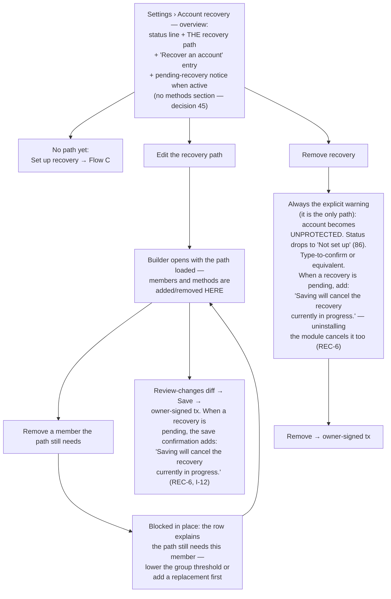

Notes:
- **Editing the setup while a recovery is pending CANCELS that recovery (REC-6, their I-12 — corrected 2026-08-25; this note used to say the opposite).** The edit and the cancel are the **same act**: their state machine names an owner edit as a first-class cancel edge, and **uninstalling the recovery module** is the other one. There is no "change one guardian without touching the running attempt" — that operation does not exist. The management screen still says a recovery is pending next to every action, and now it also says what each action will **do** to it.
- **G-05 save confirmation copy (REC-6, MVP):** when a recovery is pending, the save confirmation carries the line **"Saving will cancel the recovery currently in progress."** above the primary action — plain, not a footnote. If the pending recovery is the user's own, this is the warning that stops them destroying their own attempt; if it is an attacker's, it is the reason the edit is a *defence*.
- **G-02 removal warning (REC-6, MVP):** removing recovery uninstalls the module, so it carries the same consequence line — **"Saving will cancel the recovery currently in progress."** — on top of the existing "your account becomes UNPROTECTED" warning.
- Guardian replacement is an Edit case; the health-check alert (Flow F) and the post-cancel triage (Flow D2) both deep-link here as the fix path.
- "Recover an account" is reachable from this overview too, not only from the fresh-install welcome.
- Methods have no top-level list or "remove method" entry (decision 45): every member/method change happens inside the path editor and ends in a review-changes diff before one owner-signed transaction. The method-in-use block fires from the editor, not from the overview — and with one path it is an in-place validation (threshold/coverage), not a cross-path modal.
- A deferred post-recovery cleanup (decision 46) surfaces here as a flagged banner ("a method from your last recovery is still flagged — replace it") until resolved.

---

## Display rules (decision 69)

| Data type | Form |
|---|---|
| Address | `0x2b0F…6ef5` (4+4) everywhere; full 42 chars only on review/confirm blocks |
| ENS | full, ellipsize over 24 chars |
| Tx hash / challenge | `0x8f31a27b04ce…5d19c2` (12+6) |
| Signature / approval blob | 12+8, one form per screen |
| Hidden value mask | 16 dots + `hidden` chip |
| Member lists | show 3, then "+K more" |
| User-typed method names | 24-char cap in interpolated copy, ellipsized |

## What persists (decision 70)

| Record | Lives | Wiped by |
|---|---|---|
| Setup draft (inventory, the path, enrollments, waiting period, password-set flag) | this device, until saved on-chain | save confirm · "Start over" (platform credentials survive) |
| Recovery claim set (per-row approvals/claims) | this device, across pauses and resumes — **but each claim carries its own `valid_until`** (decision 91) | flow exit (finished or abandoned) · owner cancel · submit · **per-claim expiry** (that row only, REC-28) · **another attempt opening** (the WHOLE set, REC-27) |
| Pending-recovery countdown state | chain (persistent) | execute · cancel |

Deferred (kept open from the 2026-08-18 attack round): re-read-config-on-resume rules and the stale-draft/setup-changed states (M9); attack-during-triage band (M13); guardian changed-mind block on E1-05 (M16); alerts-honesty rewrite (M23). (M34, the DKIM-rotation failure split, died with ZK Email — decision 80.)

## Milestones (decision 79)

Three releases split the flows. Definitions: **MVP** = one person can protect one account and recover it, with all 4 methods (non-negotiable), configured from a preset shape **or from a blank start** (decision 82) — but always on the guided rails. **V1** = the guided, confident product. **V2** = scale and upkeep.

| Milestone | Features (flows / screens) |
|---|---|
| **MVP** (~78 screens) | Fresh-install entry (A, A1, incl. the **gas-deposit** step A1-04 — decision 87) · **gas-deposit before submitting** (D-09, auto-skipped when funded) · preset setup, pick ONE shape (C-01, C-01b, C-01c, C-04d, C-04e) · **blank start** — the "Start from scratch" card on C-01 + the empty editor C-04f (decision 82) · **member picker + enroll-a-method sheet** (C-10b, C-10e — moved from V1: editing and blank building are unusable without them) · enrollment + mandatory tests, all 4 methods (C-05 family; the email screens C-05e/k/n swap to zkPassport after its research pass — decision 80) · waiting period (C-06, C-06c) · **recovery password + hidden values** (C-06e, D-06e, D-06f) · review + save (C-07, C-07b, C-07e) · Recovery Card, card only (C-08) · recovery chapters 1–3 (D-01…D-05b, D-06 readout, D-07 family, D-08, D-10, D-11…D-14, done-terminal without cleanup à la D-15c) · **guardian approvals, manual**: the D-07 guardian row shows the exact payload to sign + paste-back (no hosted page) · cancel flow (D2-01, D2-01b, light "cancelled" terminal, D2-03, B-03, B-03b; banner via polling, no push) · management incl. **path editing** (G-01, G-02, G-03, G-03b, G-04, G-05, G-05b, G-05c) — no remove-and-recreate to change one value · **reconciliation batch (decision 96, 2026-08-25)**: recovery-already-running band + distinct submit-rejected cause (REC-26) · "your approvals are void" state (REC-27, copy) · "cancelling may not land" banner state (REC-29, copy) · counterproof-cancel copy on D2 / countdown / terminal (REC-30, copy) · fresh-device account-discovery help (REC-31) · publication disclosure on E1, the D-07 manual row, C-05 and C-07 (REC-17, copy) · destination key + "what this removes" on D-11, E1 and the D-07 manual row (REC-33, copy) · per-claim expiry countdown, expired-claim state, "ask again" (REC-28) · trust-root-declaration and permanent-lockout copy on C-07 (REC-13) · **Confirm password on C-06e** and the password now REQUIRED at the hidden levels (decisions 90/95) · G-05 and G-02 "this will cancel the running recovery" (REC-6) · **final ruling batch (decisions 97–98, 2026-08-25)**: the **two-state D-04/D-06 readout** — structure without a password at "Hide the details"/Public, a locked "enter the recovery password from your card" state at "Hide everything" (decision 97, REC-25 resolved) · **setup disclosure #5** — one per-level reveal line on each option of the C-06e visibility radio · **setup disclosure #4** — "identity is not presence" on the C-05 zkPassport and Anon Aadhaar enrollment rows and repeated per ID row on C-07 · **setup disclosure #6** — the backup trade, already carried by the decision-90 line on the C-06e password step (tagged and aligned, not duplicated) |
| **V1** (~42 screens) | Hosted guardian page, sync (E1-01…E1-08 incl. mobile, decline, offline signing) · Express wizard education layer (C-02, C-03 family, C-04, C-04b, C-04c) · dry run (C-07h…m) · Advanced builder — the free canvas, the method-library view, the right-rail layout, save-and-sign without a wizard review, tests offered not enforced (C-10, C-10c, C-10d, C-10f; the picker and enroll sheet ship earlier in MVP) · nudge system (B-01, B-02) · alerts / push notifications (C-08 alerts part, D2 push) · same-install account list (part of D-02/D-02b) · deferred attack-round states (M9, M13, M16, M23 — M34 died with ZK Email) · **reconciliation batch (decision 96)**: extra-door enumeration at setup + the post-recovery terminal that does not claim the account is clean (REC-34) · repayment row near C-06 and on C-07's trust list and the guardian payload surfaces (REC-36) · guided "set up recovery again" follow-on after a completed recovery (REC-39) · migrate-assets state for the existing-account route (REC-40) · the counterproof **cancel-gathering flow** — D-07 mirror, CANCEL variant of E1, keyless entry (REC-30) · **graded setup disclosures #1/#2/#3 on the C-07 trust list** (decision 98, rides with the fragility grading of decision 86): single point of failure · shared failure · adopt-at-your-own-risk for a module with no trust-root declaration — the ungraded parts of #1/#2 already ship in MVP and stay; #7 extra doors is the REC-34 row above |
| **V2** (~13 screens) | Post-recovery cleanup (D-15 flagged version, D-15d, G-01b) — **now including the post-recovery re-salting row (REC-37, decision 96)** · post-cancel triage (D2-02, G-01c) · apply to other accounts (C-09 family) · health checks (F-01, F-02 + "Last check" stat) · **fragility grading + the graded "Recovery ready" meter** (decision 86 — MVP/V1 show a plain set-up/not-set-up status line) · async approvals (E2 — skipped, decision 89) · IPFS/IPNS page hosting · multichain stays **deferred** (REC-5 — not decided; the safety note in the header is the current position) |

Consequences carried by the split:
- **How much can an MVP user configure (decision 82):** everything except the free canvas. Both MVP editors — C-04e/C-04f during setup and G-05 after saving — can add or remove required rows, add or remove members, change a threshold, and **add a group**. So the reachable MVP envelope is any shape of required rows plus one or more groups, started either from a preset or from blank. What waits for V1 is the Advanced builder's *product*, not the capability: the free canvas, the library view, the right rail, save-without-review, optional tests.
- **New MVP screen state (queued for the Pen agent):** the D-07 guardian row in manual mode — exact payload (account, new owner, nonce) with a copy button, plus the existing paste-approval field. The "send them the link" copy is V1.
- **MVP honesty copy:** with cleanup and triage in V2, methods tied to a lost device stay live after recovery, and a cancelled attacker keeps a working method. The MVP "done" and "cancelled" terminals must say this and point to the MVP defenses: edit the path (G-05), remove recovery (G-02), or move funds. Decisions 20/46 stay decided; they ship in V2.
- **Reconciliation consequences (decision 96, 2026-08-25):** the MVP grows **copy, not screens**, almost everywhere — nine of the twelve MVP items above are lines on screens that already exist (REC-17, REC-27, REC-29, REC-30, REC-33, REC-13, REC-6 twice). The three that need real state are the **already-running band + rejected cause** (REC-26), the **expired-claim row** (REC-28), and the **fresh-device discovery help** (REC-31). Two MVP honesty positions get **harder**, not softer: a lost card **plus** a lost password now means no recovery at a hidden level (decision 90), and a cancel sent after the wait ends may simply lose the race (REC-29).
- **Final ruling batch consequences (decisions 97–98, 2026-08-25):** the MVP again grows **copy plus one state**, not a screen family. The one real state is the **"Hide everything" locked readout** on D-04/D-06 — an entry that says the account IS configured and we cannot read it yet, which is neither the masked-values state nor the "no recovery set up" error. Everything else is lines on screens that already exist: three reveal lines on the C-06e radio (#5), one sentence on each ID enrollment row and its C-07 echo (#4), and a **tag** on the decision-90 line that already states the backup trade (#6). The V1 side adds **no screens either** — #1/#2/#3 are the copy layer of the fragility grading that decision 86 already scheduled, so they ship when the grading rules exist and not before. One dependency to keep visible: the whole two-state readout rests on decision 97's **assumption** that the middle privacy level exists at all; if kit-ask REC-24 comes back negative, the dial collapses to Hide-everything vs Public and the structure-without-password state loses its default.
- **Method set is not renegotiated (decision 94):** we keep all four methods and keep assuming **Anon Aadhaar works** (SDK assumption A2). Their Q-7 contingency — cutting Aadhaar leaves the count short with email gone — is **their** open question, not a change to our MVP scope. If it ever lands, decision 79's "all four, non-negotiable" is what gets renegotiated, and this line is the pointer.
- **MVP blockers (kit team):** **zkPassport integration + prover** (decision 80) · group encoding (T10) · confirm the execute-repays-`msg.sender` mechanic (87 — flagged as may-change). Closed since decision 79: value visibility (answered by 84, commit-reveal), the 24h revert surface (gone with 85), and funding-as-blocker (87: MVP is user-funded via the gas-deposit screens; paymaster sponsorship is V1)

| # | Question | Answer |
|---|---|---|
| 1 | Account creation in recovery entry | Explicit step, fast-tracked (Flow A1) + warning screen. |
| 2 | Nudge trigger + re-nudge | Modal each open + "Don't remind me again" + passive shield badge. |
| 3 | Setup modes | Three: Express, Presets (landing state), Advanced. |
| 4 | Method set v1 | All 4. Aadhaar for everyone, listed last, badged. |
| 5 | Terminology | "Account recovery" / "recovery path" / "method" / "waiting period" in UI; spec terms in prose only. |
| 6 | Honest copy for floor cases | Yes — concrete copy in Flow B. 7702 vs 4337 deferred. |
| 7 | Gas for recovery | ⚠️ **Escalated to blocker**: paymaster can't sponsor direct calls; no relayer exists (backend-zero). **Narrowed by #87**: MVP is user-funded (gas-deposit screens); paymaster sponsorship V1. |
| 8 | Identify lost account | Address / ENS / gated same-install list + confirm-identity card. |
| 9 | Guardian-side UX | Hardened IPFS/IPNS page (E1 default): real payload incl. nonce, no fake expiry, blocking out-of-band step, decline branch, offline signing. **Milestone note (79): the hosted page ships in V1; MVP guardians sign the raw payload shown on the recoverer's checklist row.** **Superseded in part by #91 (2026-08-25): the "no fake expiry" rationale is inverted — approvals carry an enforced `valid_until` (their I-13 rejects stale proofs at the door), so the page SHOWS the expiry. The rule survives in its general form: never display a limit the contract does not enforce — but this one it does.** |
| 10 | Proof collection state | Local persistence, resumable, switch-path exit; atomic submission. **Amended by #73**: the switch-path exit no longer exists. |
| 11 | Pending-recovery alert | Banner + notification + alerts opt-in at setup. Polling caveat accepted. |
| 12 | Waiting period default | 48h flat, changeable. **Confirmed also for single-method paths.** Guardrails: minimum floor + dominated-path warning. **Superseded by #74**: one waiting period per account, 24h contract floor; the dominated-path warning is retired. |
| 13 | Multi-account | Offer "apply same setup" with R10 constraints (fresh accountCode auto; linkability warnings). Never by default. |
| 14 | Health checks | In scope → Flow F. Meter = "Recovery ready". **Downgraded to optional capability by #42.** |
| 15 | Chain scope | One chain per policy. Ethereum focus, Sepolia demo. Multichain out of scope v1. |
| 16 | ZK Email mechanics | **Narrowed by #55**: transport is local `.eml` proving, no relayer. Still open: subject/command format, accountCode storage, prover stack + latency. |
| 17 | Passkey on new device | Platform sync + WebAuthn hybrid. |
| 18 | Guardian page wallets | Injected + WalletConnect + offline signing path. |
| 19 | After waiting period | Notify + auto-execute — intended UX; **executor unresolved** (see #7). |
| 20 | Config survives rotation? | Assume yes → makes the end-of-recovery cleanup checklist REQUIRED. **Milestone note (79): the cleanup checklist ships in V2; the MVP done-terminal carries the honesty note instead.** |
| 21 | Express presets | Owned by ottie's persona research. |
| 22 | Mixed-method OR-groups | **Decided — assumed valid** (PR #2 review); generalized by #41. Encoding confirmation with kit team (T10). |
| 23 | Guardian gas (E2) | Needs sponsorship; one of E2's three blockers. |
| 24 | Multichain | Out of scope v1. |
| 25 | Fast-track onboarding | Warning screen + password + key + seed backup. Corrected copy (address never changes). |
| 26 | Express wizard shape | Guided, short, inventory step; draft/resume; alerts opt-in. |
| 27 | Verify-access | Mandatory for identity methods; guardians optional, open. Mutual guardian approval = under consideration. **Guardian side confirmed optional by #52.** |
| 28 | Setup gas / batching | User pays if funded, else paymaster. Batching partially answered (thread T7: one batched UserOp — conceded, unwritten). **Narrowed by #87** for recovery submission: user-funded MVP. |
| 29 | Config visibility | Structure readable; value visibility OPEN (guardian addresses natively public today); password-decrypt case stays. **Answered by #84** (commit-reveal; user-chosen exposure). |
| 30 | R9 orthogonality gate | **Not now** — invariants/tech design under rework; violations allowed; revisit later. |
| 31 | Guardian mutual approval | Best-effort stands; mutual approval noted as a considered path. |
| 32 | Management flows | Mapped → Flow G. |
| 33 | User-facing name | "Account recovery". |
| 34 | Logged-in recovery entry | Settings button. Multiple accounts → choose the new owner; single account → step skipped. |
| 35 | Claim handling in the checklist | Per-method verify button (explain + submit in place). Claims wiped on flow exit. **Amended by #73**: path switching no longer exists; claims survive pauses and resumes. |
| 36 | Single-guardian setups | Supported: one guardian, 1-of-1 groups. No minimum guardian count (wireframe review). |
| 37 | Two-method inventories | Wizard recommends two single-method paths, not an AND pair. 48h default stays. **Superseded by #75**: the recommendation is one [1 of 2] ANY-of group inside the single path. |
| 38 | Passkey type | Detect synced vs device-bound (WebAuthn backup-eligibility flag); warnings adapt. |
| 39 | Self-held keys inventory | "Keys you keep yourself — paper or hardware" inventory item routes to guardian entry. |
| 40 | Logged-in entry warning | Condensed anti-scam warning + acknowledgment gates the Settings entry too. |
| 41 | ANY-of groups generalized | M-of-N threshold over any mixed members; guardians are ordinary members (no special threshold); free mix of required rows + groups per path; wizard "any M of N" → one path, one group. **Amended by #73**: groups stay generic, but the OR-of-paths level is removed — one path per account. |
| 42 | Health checks priority | Optional capability, not the v1 focus (wireframe feedback). Flow F stays mapped; the meter is a status line, not a headline feature. Downgrades #14. |
| 43 | Guardian display | No guardian names anywhere: a guardian **is** an address. UI shows blockie + address (or ENS). The wallet stores no names or contact labels — nothing extra to leak. |
| 44 | Recovery-in-progress screen | Resuming an unfinished recovery lands on a dedicated "Recovery in progress" screen (account, per-row progress, resume / abandon) — the home-surface pending card is only the entry point. |
| 45 | Method management | Methods are managed **inside path editing** (edit path → review-changes diff → one owner-signed tx). The management overview shows the path only (the single one since #73) — no separate methods section or top-level "remove method". |
| 46 | Cleanup deferral | Deferring the post-recovery cleanup is allowed; it surfaces as a flagged banner state on the management overview until resolved — not a separate screen. **Milestone note (79): ships in V2 with the cleanup itself.** |
| 47 | Dry run at setup | The wizard offers a local recovery rehearsal before the final save (demo-review meeting): complete each method's row as if the key were lost today. Optional, skippable; no chain interaction. |
| 48 | Recovery password setup | The password that encrypts recovery values is set in an explicit, skippable wizard step between waiting period and review (audit result; wireframe C-06e; same control on the Advanced builder). **The card hint is DROPPED** — audit risk: a hint can leak configuration and cannot be validated. Forget-protection is the dry-run recall row instead. **Amended (2026-08-25) by #90 + #95:** the step is **no longer skippable** — it is REQUIRED at "Hide everything" and "Hide the details", and ABSENT at "Public" (per #84). The card carries the **password itself**, not a hint, so the hint question is moot. Forget-protection is now the **Confirm password** field (#95) plus the card; there is **no dry-run recall row in the MVP** (the full dry run stays V1). |
| 49 | Single-method recommendation | Never force a second method. Recommend one — explicitly including "a second passkey from another device". Copy on the single-method wizard states. |
| 50 | Synced-passkey cleanup semantics | A synced passkey stays flagged after recovery while a lost device remains signed in to the platform account; the fix path includes revoking the device/passkey from the platform or password manager. Closes the v5 spec gap. |
| 51 | Guardian page hosting | **Relative (extension-served) path first; IPFS/IPNS later.** Simpler for integrators as a starting point. Closes the hosting item in the tech-dependencies table. |
| 52 | Guardian verification at setup | Confirmed optional (demo-review meeting) — no forced guardian signature during setup; reaffirms #27. |
| 53 | Metadata encryption options | Three candidates: encrypt nothing / policy only / policy + metadata. Choice sits with the kit team; the schema must be fixed once (versioning possible, one standard preferred). Q29 stays open; UX must follow the choice. **Answered by #84**: the kit ships all three as user-selectable hiding levels. |
| 54 | Verify-access scope | The wizard's identity-method tests stay mandatory and blocking (#27). The **Advanced builder offers tests without enforcing them** — a power user may save untested methods (wireframes C-10d/C-10e). |
| 55 | ZK Email transport direction | **Local proving**: the user obtains the raw `.eml` (Gmail: ⋮ → Show original → Download original) and the wallet verifies/proves from it on-device. Open with the kit team: exact subject/command format, accountCode storage, in-extension proving latency (~15–60s). Redrawn in C-05e/D-07e; the 6-digit-code illustration is retired. **Amended by #77**: the user RECEIVES the email (an external relayer sends it on "Send email") instead of sending it; proving stays local. |
| 56 | Recovery password lifecycle | Set once at setup; **no change or removal surface**. A forgotten password never blocks recovery — it only keeps values hidden (D-06e). The dry run's recall row is the forget-protection. Note: editing guardians re-encrypts under the same password. **Amended (2026-08-25) by #90:** "a forgotten password never blocks recovery" is **retired** — it was only true at Public. The password is **printed on the Recovery Card**, so the ordinary answer to forgetting it is "read it off the card". The honest residual: at a hidden level, losing **both** the card and the password means a fresh device **cannot begin a recovery**. Forget-protection is the Confirm-password field (#95) + the card, not the dry run. D-06e's copy is corrected accordingly. |
| 57 | Password naming | One name everywhere: **"extension password"** (the device-unlock password). "Full wallet password" is retired from all copy. The recovery password (decision 48) stays a distinct, clearly separated concept. |
| 58 | Wizard step map | Ten numbered steps: 1 how-it-works · 2 inventory · 3 recommended path (singular since #73) · 4 enroll · 5 waiting period · 6 recovery password · 7 dry run · 8 review+save · 9 card+alerts · 10 apply-to-others. Single-account wallets skip 10 → "OF 9". Preset deep-links get their own landing (C-04d) with a renumbered short run. The fast-track onboarding is a prologue labeled "SET UP THIS DEVICE · N OF 3", so only one recovery counter exists. |
| 59 | Status chip vocabulary | Setup: Not started / In progress / Tested / Saved / Live ("Saved" only for methods with no test). Collection: Not asked / Waiting / Complete. Retired as chips: Enrolled, Created, Confirmed, Passed, OK, Added, Satisfied, Kept. |
| 60 | Progress counting | A group counts as ONE unit in checklist headlines. Grammar: "N of M done — X methods and Y groups", numerals throughout; one group-aware subhead everywhere. |
| 61 | Role & artefact naming | "Guardian" for the human role in prose and help; "member" only inside group headers; "person"/"your people" retired from labels. The guardian's artefact is an **approval** on both sides ("signature" survives only inside the offline-signing block). **Preset names follow: "Your device + your guardians", "Guardians only".** |
| 62 | Threshold display | Component / Threshold renders EVERY read-only threshold (full sweep — supersedes the earlier leave-as-is). Hand-drawn threshold text survives only inside editable builder controls (C-10 family, G-05). |
| 63 | Error-state rule | An error state renders its base screen unchanged and only adds the error card. |
| 64 | Wizard footer rule | Every non-first step keeps a Back; skip/exit are extra actions; in-body options set state and never advance. |
| 65 | Card & alerts re-access | The Recovery Card (download/print) and the alerts opt-in live permanently on the management overview. No forced routing for Advanced users. |
| 66 | Dismissal scope | "It's me" binds to one recovery request; a new request warns again. Stated under the action. |
| 67 | Frame naming rule | Future sequence suffixes are letters skipping "m"; mobile variants use "-mobile". No renames of existing frames. |
| 68 | Transaction feedback | Every owner-signed write gets the shared submitting + failed states (D-11b/C-07b anatomy): builder save, path-edit save, cleanup remove/replace, post-cancel replace. |
| 69 | Display rules | One truncation form per data type and a list-overflow rule — see the "Display rules" section. Interpolated user-typed names get a length cap; presets keep their names on edit, no renaming in v1. **Amended by #82**: a path **loses its preset label** once editing changes its shape — it then renders as "Your recovery path"; a path built from a blank start never carries a preset label. **Amended by #73**: path index labels die — there is one path; groups keep index labels in the Advanced builder ("Group 1", "Group 2"). |
| 70 | Local persistence | What persists, for how long, and every wipe trigger — see the "What persists" section. "Start over" never deletes platform credentials. **Amended by #91 (2026-08-25):** claims still survive pauses and resumes, but they **may expire** — a resumed recovery must **re-check every claim's validity** and surface the expired ones instead of counting them as done. Two more invalidation triggers join the table: per-claim expiry (that row) and another attempt opening (the whole set). |
| 71 | "Last check" stat | Renders only when the health-check capability is enabled (decision 42). **Amended by #73**: the v1 stat row is methods / waiting period (the paths count died with the single-path model). |
| 72 | Multi-account apply mechanics | Apply = one owner-signed transaction per selected account, re-entering enrollment per account; primary disabled at zero selection; per-account progress state (C-09c). |
| 73 | **Single recovery path** (2026-08-18) | One recovery path per account — the OR-of-paths level is removed. The path = required method rows AND ANY-of groups. No path choice in recovery; no "Add recovery path"; no second-policy future planned. UI naming stays "recovery path" / "recovery method". Old multi-path screens move to an OUTDATED wireframe band. |
| 74 | Waiting period v2 | One waiting period per account (the path's). **Contract enforces a 24h minimum** — the picker floor is 24h. 48h stays the UI default. Dominated-path warning retired. Supersedes #12's guardrails. **Superseded by #85**: the contract minimum is removed; 0h is legal with a picker-only warning. |
| 75 | Path shapes: wizard vs Advanced | Wizard/presets build required rows + at most ONE ANY-of group over the selected methods. Multiple groups per path are Advanced-only. Presets remap: "Your device + your guardians" = passkey AND [2 of 3](guardians); device+email = passkey AND zk_email (both required); "Guardians only" = [2 of 3](guardians). Two-method inventories → one [1 of 2] group (supersedes #37). **Restated by #82:** what is Advanced-only is the free-canvas *builder*, not multi-group capability — the setup editor (C-04e/C-04f) and the path editor (G-05) can add a group, so multi-group paths are reachable in the MVP. The wizard's *recommendation* still proposes at most one group. |
| 76 | Instance uniqueness | One enrolled method instance (specific passkey, guardian address, email) appears once across the whole path — never as a required row and a group member at the same time. Method types may repeat with different values. The builder blocks the duplicate. **Amended by #93 (2026-08-25):** this is a **wallet-side policy, not a contract rule** — their contract deliberately allows naming the same person twice. The block stays (it is ours to keep), but it moves to the wallet-side list in #81(a) and the copy must never claim the chain rejects it. |
| 77 | ZK Email receive-and-upload | The user clicks **"Send email"**; an **external relayer** sends an email to the enrolled address. The user downloads the raw `.eml` ("Show original") and uploads it; the proof is created locally. Amends #55. A **"How to get the .eml" help sheet** covers Gmail, Outlook (web), Apple Mail, Yahoo, Proton — linked from the enrollment test and the recovery verify row. **Amended 2026-08-20 (PR #2 review):** the proof runs over the email the user SENDS, so one step joins the flow — the user **replies** to the relayer's email ("Confirm"), then downloads **their own reply** from Sent (same "Show original" mechanic) and uploads that. Assumed to work end to end. Wireframe updates (C-05e, D-07e, C-05n) queued — held while the team decides ZK Email vs zkPassport. |
| 78 | Account type focus | The initiative focuses on **4337 smart accounts**; 7702 support is deferred. Recorded only — no user-visible copy change now. |
| 79 | **Milestone split** (2026-08-18) | MVP / V1 / V2 — see the "Milestones" section. Fibo's rulings: all 4 methods MVP; guardian page → V1 with a manual sign-this-payload MVP mechanic; post-recovery cleanup + post-cancel triage → V2 (cancel itself stays MVP); recovery password MVP; path editing MVP ("no remove-and-recreate to change one value"). Q29/53 becomes MVP-blocking. |
| 80 | **zkPassport replaces ZK Email** (2026-08-20) | The method set becomes passkey · guardians · **zkPassport** · Anon Aadhaar (Aadhaar stays). ZK Email is dropped entirely — with it go the send-only relayer requirement, the `.eml` upload, the "How to get the .eml" help sheet (C-05n), the accountCode custody problem, and decisions 16/55/77 as live rules (they stay in the log as history). **Personas:** wherever a persona used ZK Email it maps to zkPassport — Diana `[1 of 2](passkey, zkPassport)`, Bob `[2 of 3](passkey, guardian, zkPassport)`. **Update 2026-08-24: the research pass is DONE** (`social-recovery-zkpassport-research.md`; verdict negative for MVP, recommendation V1 — team decision pending), then a Pen round to redraw C-05e/C-05k/C-05n/D-07e and the preset, plus the persona/demo remap and the stale ".eml" copy on X-02, the deck's Milestones slide and the Milestones section. Wireframes and demo still show the email method until that round runs. |
| 81 | **Grading is ours; the 4337 account can reuse an existing key** (2026-08-20) | Two rulings from the PR review. **(a) Safety grading is wallet-side, not SDK-side.** The SDK serves many wallet implementations and each sets its own bar for "safe enough", so it returns path + method metadata and no verdict. The fragility rules, the "Recovery ready" meter (42/71) and the honesty copy that hangs off them are ours to define. Structural validity (thresholds; the 24h floor has since been removed by #85) stays in the SDK — those are contract rules, not opinions. **Amended by #93 (2026-08-25): instance uniqueness moves OUT of that list and into the wallet-side one** — it is our policy, not a contract rule, because their contract deliberately allows naming the same person twice. **(b) The 4337 account does not have to be new.** The demo's main flow creates one, but an **existing EOA can be set as its signer**, so a current user keeps their key and skips a second seed ceremony. Flow C does not draw that route yet — new screen state to design. Note the address nuance: onboarding into a 4337 account means a new account address; decision 25's "your account stays at the same address" is about *recovering* an existing 4337 account, and stays true. |
| 82 | **Blank start; how far MVP configuration goes** (2026-08-20) | A fourth C-01 card **"Start from scratch"** (dashed, no structure line) opens the new empty editor **C-04f** ("Build your path": empty REQUIRED + GROUPS sections, the same rules panel, plus "A path needs at least one method" gating Continue). Consequences: **C-10b + C-10e move into the MVP** (blank building and editing are unusable without a member picker and an enroll sheet); **multi-group is reachable in MVP** through the editors, so #75's "Advanced-only" now covers the free-canvas builder rather than the capability; **C-04e drops its "Open Advanced" pointer** in MVP and explains "Add a group" in place; a path **loses its preset label** when editing changes its shape (#69 amended). Milestone counts move to MVP ~76 / V1 ~42. Option (a) chosen: card in the grid, "Customize" re-points per milestone. |
| 83 | **Passkey health check is a user-gesture test** (2026-08-20) | Asking the user to tap their passkey is the intended mechanic, not a workaround — no browser API can silently confirm one credential still exists. So Flow F prompts for the tap and records the result; unattended runs cover only the environment, and a background failure renders as "unproven", never "deleted". Affects the F-01/F-02 copy and the "Last check" stat (71). |
| 84 | **Commit-reveal config visibility — answered** (2026-08-24) | Q29/53 closed by the kit team: config values live in encrypted logs, decrypted with the recovery password; nothing is natively public. The kit offers three hiding levels and **we expose the choice to the user** on the recovery-password step (C-06e): "Hide everything" (methods + metadata) · "Hide the details" (metadata only — the shape stays readable; **default**) · "Public" (no recovery password is set — nothing is encrypted). Un-blocks the MVP. **Amended by #97 (2026-08-25): all three levels are ASSUMED available** — "Hide the details" (structure in the clear, values encrypted) has no counterpart in the kit's current model, and kit-ask REC-24 carries the confirmation. |
| 85 | **Timelock floor removed** (2026-08-24) | No contract-enforced minimum waiting period. The picker allows **Instant (0h)** with a warning **on the picker only**: 0h removes the waiting period, so nobody can cancel a malicious recovery. 48h stays the default; D2/D-11/Recovery-Card copy stays unchanged. Supersedes #74's floor. |
| 86 | **Fragility grading → V2** (2026-08-24) | The graded report and the graded "Recovery ready" meter move to V2 (the grading rules are not defined yet — titi). MVP/V1 management shows a plain set-up/not-set-up status line. Amends the meter half of #42/#71. |
| 87 | **Funding: user-funded MVP + gas-deposit screens** (2026-08-24) | MVP recovery is paid by the recoverer: a **gas-deposit** step at onboarding (A1-04, also in the standard create flow) and one before submitting (D-09) — both auto-skipped when the account already holds enough. Contract-side support: `execute` reimburses `msg.sender` directly (per the kit team — **mechanic may change**); no batched sponsored UserOps on the executor flow. Paymaster sponsorship is **V1** (titi); who operates that paymaster stays open. |
| 88 | **Smart account at initialization + two-accounts copy** (2026-08-24) | The **standard create flow MUST deploy a smart account at initialization** (today the app creates a bare EOA) — a hard precondition for the feature. The recovery **fast-track is the exception**: it creates just an EOA, set as the signer of the recovered account, which already is a smart account (amended in review, 2026-08-24). Recovering into an existing account creates nothing and merges nothing: that account's key becomes a signer of the recovered account too, and the UI must say "this account's key now controls two accounts" (logged-in entry). |
| 89 | **Async approvals (E2) skipped** (2026-08-24) | On-chain guardian approvals would need a big recovery-contract redesign, so E2 is skipped. Alternatives noted for the future: emit the signature as an event, or an offchain approval server run by each consuming wallet. |
| 90 | **The Recovery Card carries the recovery password** (2026-08-25) | The card **prints the recovery password**. The password step (C-06e) is **REQUIRED** at the two hidden levels ("Hide everything", "Hide the details") and **absent** at "Public" (per #84 — nothing is encrypted there, so there is nothing to set). Honesty consequences, both of which must be stated in copy: **(a)** anyone holding the card can decrypt and **READ** the configuration values — they still **cannot recover**, because the recovery path itself must be satisfied; **(b)** if **BOTH** the card and the password are lost at a hidden level, a fresh device **cannot begin a recovery at all**. Amends #48 (the step is no longer skippable at hidden levels) and #56 (see that row). From REC-1. |
| 91 | **Guardian approvals expire** (2026-08-25) | The contracts spec enforces **`valid_until` at submission** — their invariant **I-13 rejects any stale proof at the door**. This **supersedes decision 9's "no expiry" rationale**: an approval now dies at **expiry**, at nonce consumption, or at cancellation. **E1 and the D-07 rows SHOW the expiry** (deadline + countdown). Also **amends #70**: claims survive pauses and resumes **but may expire**, so a resumed recovery must re-check claim validity and surface expired claims rather than counting them as done. From REC-7 / REC-28. |
| 92 | **Cross-account linkability is conditional** (2026-08-25) | Method and guardian **reuse is invisible at rest ONLY if the SDK mints fresh per-account (and per-credential) salts**. Their **R-16** attack: under salt reuse, recovering one account **unmasks another account's setup**, because the commitment is recomputable across accounts. So the old flat claim "reuse is observable on-chain" is replaced by a conditional one, and the **linkability warning moves from C-09 (setup) to the submission/approval moment** — D-11 and the guardian surfaces — where the reveal actually happens. The "create a fresh passkey for this account" offer stays at setup as the mitigation. From REC-8. |
| 93 | **Instance uniqueness is our choice, not a contract rule** (2026-08-25) | Their contract **deliberately allows naming the same person twice**; the wallet blocks it as **policy**. The rule itself is unchanged and stays enforced in our builder — what changes is where it belongs and how we describe it: it moves to the **wallet-side list** and no copy may claim the chain rejects a duplicate. Amends #76 and #81(a). From REC-9. |
| 94 | **Our presets take precedence over their tiering** (2026-08-25) | We do **not** adopt the contracts team's primary/secondary method weighting — a verdict on rule quality is wallet-side by #81(a). **Preset 2 (`passkey AND zkPassport`, both required) stays**, despite being their discouraged shape. The method set stays **passkey + guardians + Anon Aadhaar + zkPassport** (reaffirms #79 and #80), and we keep assuming **Anon Aadhaar works** (SDK assumption A2), so their Q-7 contingency does not change our count. From REC-3 / REC-4 / REC-14. |
| 95 | **C-06e gains a Confirm-password field** (2026-08-25) | The recovery-password step carries **Password + Confirm password**. There is **NO dry-run password-recall test in the MVP** — the full dry run stays V1 (#47). With #90, forget-protection in the MVP is the confirm field plus the password printed on the Recovery Card. From REC-38. |
| 96 | **Reconciliation states batch** (2026-08-25) | New states and copy from the contracts-spec reconciliation, with milestones. **MVP:** recovery-already-running band + distinct submit-rejected cause (REC-26) · fresh-device account discovery (REC-31) · per-claim expiry countdown, expired-claim state, "ask again" (REC-28). **MVP copy:** "your collected approvals are void" (REC-27) · "cancelling may not land" once the wait ends (REC-29) · counterproof cancel (REC-30) · helper-publication disclosure (REC-17) · destination key + "what this removes" (REC-33). **V1:** extra-door enumeration + the terminal that does not claim the account is clean (REC-34) · repayment row (REC-36) · guided re-setup follow-on (REC-39) · migrate-assets state (REC-40) · the counterproof cancel-gathering flow (REC-30). **V2:** post-recovery re-salting on the D-15 cleanup list (REC-37). |
| 97 | **Privacy levels assumed available** (2026-08-25) | We **assume the kit supports all three hiding levels of #84**, including **"Hide the details" — structure in the clear, values encrypted**. Their current model (`encrypt(password_key, config)` · `config` · `empty`) has **no counterpart** for that middle shape. The level data rides the **contract’s event logs** (the setup event’s backup field — storage keeps only the commitment, their I-16); for "Hide the details" the log carries the structure in the clear and the values encrypted (Fibo, 2026-08-25). A stated assumption, not a confirmed fact: **kit-ask REC-24** carries the request to confirm it, and the SDK doc records it as assumption **A7**. The **default stays "Hide the details"** — we do not drop the middle level or re-scope the dial to hidden-vs-public. This **un-blocks the two-state D-04/D-06 readout (REC-25, now resolved)**: at **"Hide the details"** and **"Public"** the structure — THE path — renders from the setup-event data with **no password at all**, and only the VALUES wait for the card password; at **"Hide everything"** **nothing** renders before the password. From REC-1. |
| 98 | **Setup disclosures adopted** (2026-08-25) | Ruling on the contracts spec's **Q-8** disclosure list. **MVP copy:** **#4 identity ≠ presence** — an ID proof shows what the document says, not that the person acted just now (C-05 zkPassport and Anon Aadhaar enrollment rows, repeated on the C-07 review) · **#5 what your privacy level reveals** — one reveal line per option on the C-06e visibility radio · **#6 the backup trade** — lose the card **AND** the password at a hidden level and a fresh device cannot recover (C-06e password step; this is the line #90 already put there, tagged — not a second line). **V1, with the grading work:** **#1 single point of failure** · **#2 shared failure** · **#3 adopt-at-your-own-risk** (a module with no trust-root declaration) — parts of #1/#2 exist on C-07 today and stay as they are; the full **graded** treatment ships with fragility grading (#86). **#7 extra doors** is already V1 via REC-34. The **eighth** disclosure (destination key on approval) is already applied (REC-33, #96). **The rendering guarantee is the UX's, never the SDK's** — REC-18 confirmed, reaffirming #81(a) and SDK assumption **A6**: the SDK supplies facts (trust-root declarations, tiers, method metadata) as data; we render them and we judge them. From REC-35 / REC-18. |

---

## Tech dependencies — route to the kit team

| Item | Blocks | Ref |
|---|---|---|
| Funding — **narrowed by decision 87**: MVP is user-funded (gas-deposit screens); `execute` repays `msg.sender` (confirm final mechanic — flagged may-change); remaining: who operates the V1 sponsorship paymaster, and what stops a sponsored permissionless entry point from being drained | Flow D submit (V1 sponsorship) | Q7/19/87 |
| **zkPassport integration** (decision 80, replaces the whole ZK Email row): what the user presents (NFC document scan / photo / app hand-off), proof budget in-extension, verifier deployment per chain, nullifier + linkability semantics, and whether an enrollment secret must join the backup set | zkPassport sub-flows + verify-access + C-05/D-07 redraw | 80 |
| Confirm the encoding for generic ANY-of groups — mixed member types, M-of-N thresholds (T10 `threshold` field) | Builder + presets + recovery checklist | Q22/41 |
| Per-account unlinkability for the ZK method (R10) — was ZK Email's `accountCode`; re-ask for zkPassport's nullifier scheme under decision 80 | Multi-account apply | 80/R10 |
| ~~Exact guardian signed payload~~ **ANSWERED by the spec-v1 reconciliation (decision 91)**: the approval binds an **eleven-field digest** including `purpose`, **`valid_until`** (enforced at submission by their I-13), `slot`, the predicted `attempt_id`, `keccak256(setup_body)` and `keccak256(handover)`. Expiry is defined and IS enforced — E1 shows it. Remaining: whether `slot` is the clause index or the credential index (REC-19) | Flow E1 page | 91 |
| ~~Policy value visibility~~ **ANSWERED (decision 84)**: commit-reveal, encrypted logs, three user-selectable hiding levels; remaining: the exact schema + how the recoverer fetches the encrypted log | C-06e, D-06 family | Q29/53/84 |
| R5 conflict (atomic vs incremental); E2 needs an approval function + indexing | Flow E2 | — |
| Setup batching: write T7's one-UserOp answer into the spec | Wizard step 6 | Q28 |
| ~~**Concurrency**: can one account hold two pending recoveries?~~ **ANSWERED (their I-10, via REC-26)**: **no — one attempt per account, EVER.** The warning band and the distinct submit-rejected cause ship in the MVP (decision 96); the attempt id is client-predicted, so an intervening attempt voids a whole gathering (REC-27) | Flow D chapters 1/3, Flow D2 | M10/I-10 |
| Config survival after rotation (+ `onUninstall` nonce-reset issue) | Flow D end state | Q20 |
| Same-install account history lookup, gated | Flow D identify step | Q8 |
| Guardian approval-page hosting — **decided: relative path first, IPFS/IPNS later (decision 51)**; remaining question for the EF: long-term canonical hosting | Flow E1 | 51 |
