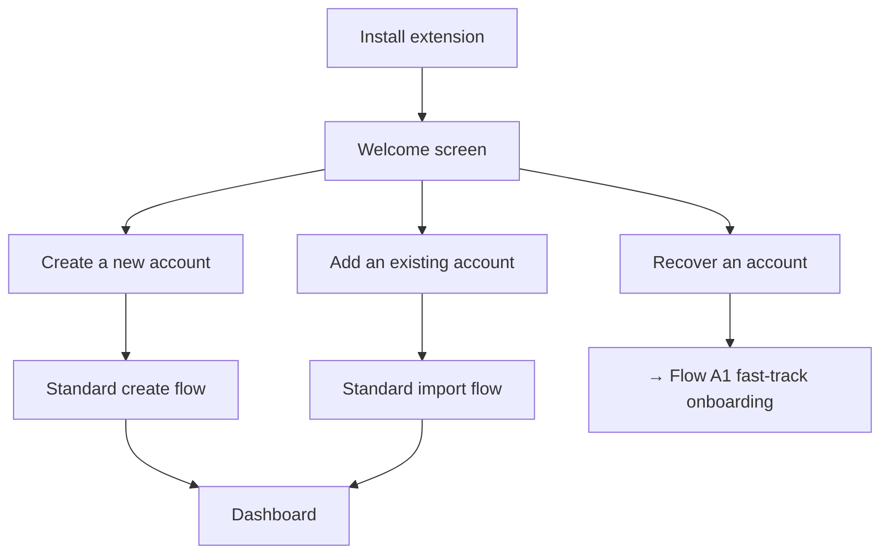
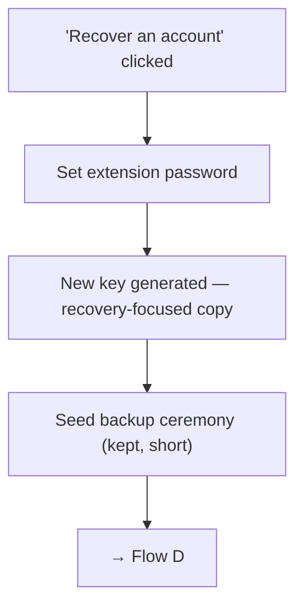
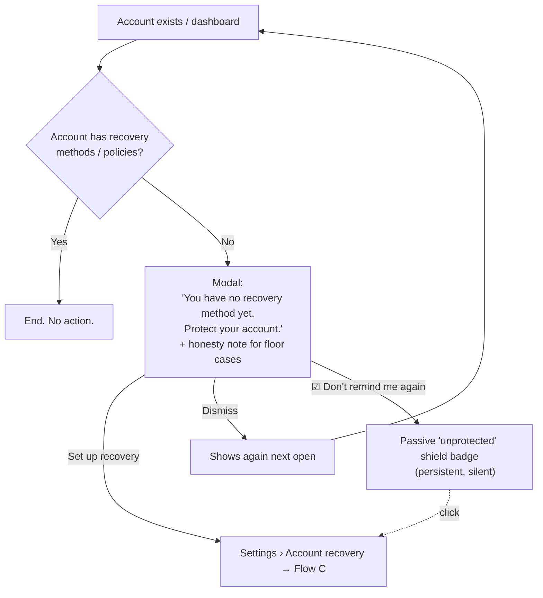
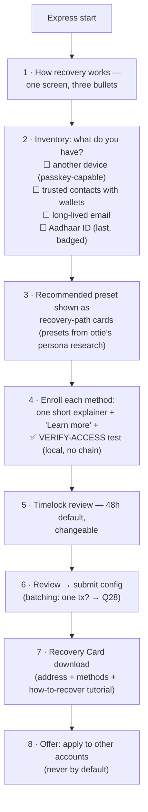
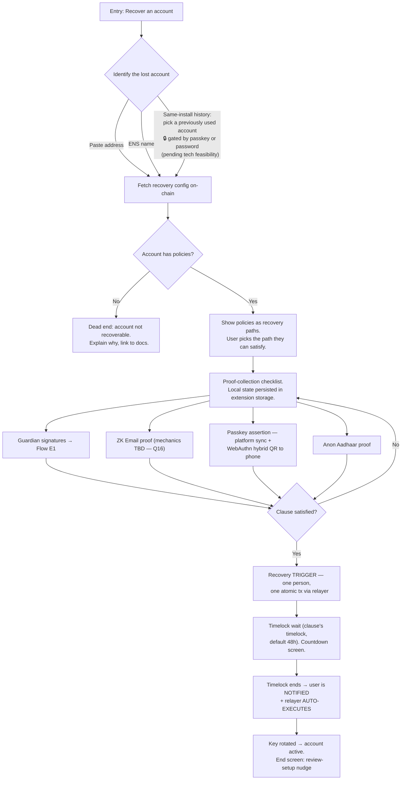
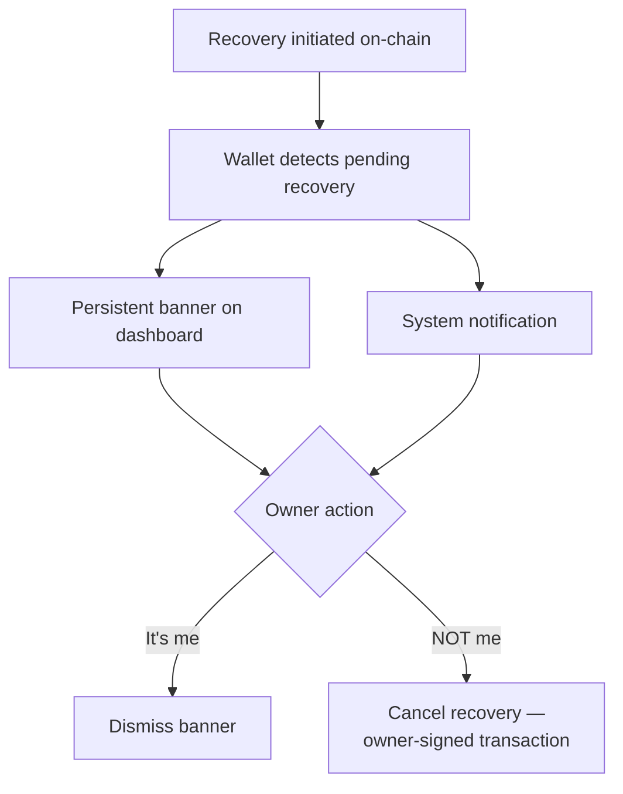
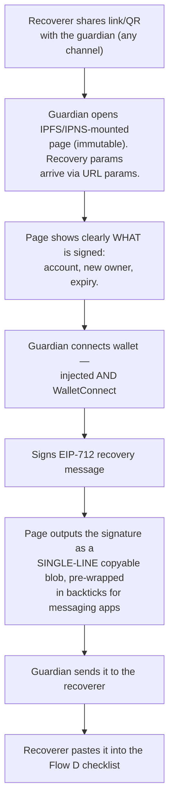
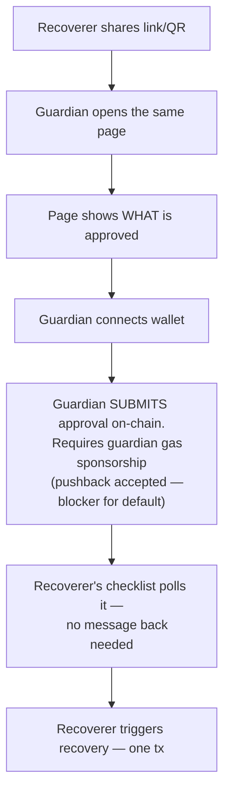
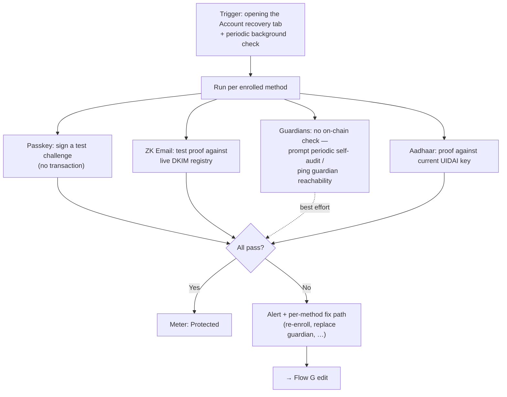
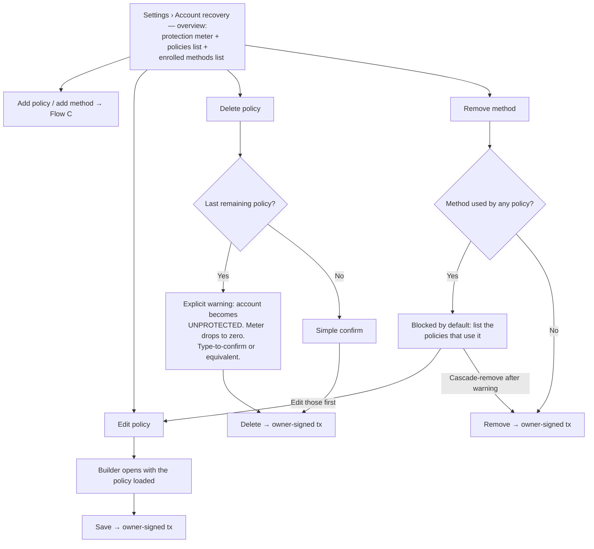

# Social Recovery — UX Flow Diagrams (working doc)

> Working document. Owner: Fibo. Status: **draft, in construction**.
> Sources: social-recovery prototype HTML (demo), Notion "Personas" page (Alice → Sam),
> Design Rationales R1–R13 (policy model: OR-of-AND clauses, per-clause timelock).
>
> Framing: the social recovery initiative is a **general-purpose improvement for the
> ecosystem**. This extension is the demo/reference app that shows what can be done.
> These flows are therefore **reference UX**, not app-only decisions.
> This document will live as a **sibling to the Notion pages** (personas, rationales).
>
> Naming (decided): the user-facing label is **"Account recovery"** everywhere in the
> UI. "Social Recovery (Kit)" stays as the internal/tech name only.
>
> Context: the UX lives under **Settings › Account recovery**. The recovery module is
> ERC-7579, on a 4337 smart account or a 7702-upgraded EOA. 7702 vs 4337 copy
> differences: deferred. Chain scope: **one chain per policy**; demo runs on
> **Sepolia**; focus is Ethereum. **Multichain: out of scope for v1** (decided) —
> note for integrators: rotation happens on one chain; the same address on other
> chains stays locked.

---

## Flow A — Extension first open (entry points)

Fresh install. The user sees three options.

### Flow A1 — Fast-track onboarding (recovery-focused)

Decisions:
- ✅ Fast-track = **extension password + key creation + seed backup**. Nothing else.
- ✅ Seed backup is not deferred. It stays in the fast-track.
- Draft copy at key creation: "This is your new key. Your lost account will move to it."

---

## Flow B — Recovery-methods check + nudge

Decisions:
- ✅ Trigger: on **each dashboard open** until the user acts or opts out.
- ✅ Permanent dismiss keeps a **passive shield badge** as re-entry point.
- ✅ Copy honesty (floor cases like single-passkey): yes, as a note.

---

## Flow C — Policy setup

Building blocks:
- **Methods:** passkey, guardians (people's wallets, EOA or SCW), ZK Email, Anon Aadhaar.
- **Policies:** OR of AND clauses. Each clause has its own timelock.
- **Internal OR inside one policy is supported and can MIX method types** (decided):
  `Passkey (required) AND [signature of A OR B]` and also
  `passkey AND [zk_email OR aadhaar]` are single policies.
  ⚠️ Encoding note for tech: mixed-type OR-groups exceed the guardian-threshold
  mechanism (R11) — needs clause expansion or a native group encoding. Confirm with
  the kit team which one the contracts use; the UI can present groups either way.

### Three setup modes (decided)

| Mode | For | Shape |
|---|---|---|
| **Express** | Least technical (Diana, Sam, Carl) | Short guided wizard. Per-step education, minimal UI. |
| **Presets** | Middle ground | Pre-defined policies already in place; the user removes/edits what they don't want. |
| **Advanced** | Alice, Bob | Free policy builder (grouped condition builder). |

**Entry pattern (decided):** no three-way fork screen. The setup tab **lands directly
on the Presets state** — starter policies visible and removable. Two actions on top:
**"Guide me"** → Express wizard, **"Customize"** → Advanced builder.

**Starter presets (decided): two policies shown by default**, 48h timelock each:
1. `passkey AND [guardians threshold group]` — recovery path: your device + your people.
2. `passkey AND zk_email` — recovery path: your device + your email.

Note: both presets require enrollment before they become active — the cards start in a
"needs setup" state and deep-link into the per-method enrollment steps.

### Express wizard — draft step list

### Verify-access at enrollment (decided this round)

Every **non-guardian** method gets a local proof test at enrollment, before the config
is saved. No blockchain interaction. **Decided: MANDATORY for the identity methods**
(passkey, ZK Email, Aadhaar) — a failing test blocks the save, because it means the
enrollment data is wrong. Guardians stay best-effort. Rationale: a recovery method
that never worked is discovered exactly when it is too late. Reuses the health-check
machinery (Flow F):

| Method | Verify-access test |
|---|---|
| Passkey | Sign a test challenge right after creation. Instant. |
| ZK Email | Generate a full test proof locally. ⚠️ Depends on Q16 (mechanics). Proof generation may take time → progress UI; it doubles as a dry run. |
| Anon Aadhaar | Test proof against the current UIDAI key. |
| Guardians | Best effort only: address checksum / ENS resolution / "is a contract?" check. A real signature test needs the guardian to act — offer it as optional. |

Other decisions:
- ✅ All 4 methods in v1. Aadhaar for everyone, listed last, badged "Requires Aadhaar ID (India)".
- ✅ Structure UI: grouped condition builder — clause card = "recovery path", required
  rows + OR-group rows with threshold selector (Safe-style). "Any one path recovers
  your account."
- ✅ Timelock default 48h per clause, changeable.
- ✅ Multi-account: offer "apply this setup to your other accounts", never by default.
- ✅ Recovery Card at the end of setup.
- ✅ Express presets and the preset mode's contents come from **ottie's persona research**.

### UI pattern references (solved problem)

Grouped condition builder with "ALL of / ANY of" headers: Notion/Airtable advanced
filters, Apple Smart Playlists, Zapier paths, Stripe Radar, `react-querybuilder`.
Threshold selector inside a group: Safe's "M out of N owners" row.

---

## Flow D — Recover an account

Precondition (Flow A1): fresh key exists. **Assumption: gas paid by relayer/paymaster
— for the recoverer AND for guardian approvals if E2 ever ships. ⚠️ Pain point if untrue.**

Decisions:
- ✅ Identify by pasted address or ENS. ⚠️ Hurts the least technical personas —
  mitigated by the Recovery Card and the same-install gated list.
- ✅ Pending-proof state lives locally. Atomic submission (matches R5). E1 is the
  default guardian path.
- ✅ Timelock end: notify + relayer auto-executes.
- ✅ Assume the recovery config survives rotation (Q20 open to confirm).

## Flow D2 — Cancel side (original owner's device)

Decisions:
- ✅ Banner + notification. Polling limitation = accepted caveat for now.

---

## Flow E — Guardian approval

**E1 (sync) is the default for v1** (decided). E2 (async) stays mapped as the desired
future improvement — pending the R5 conflict resolution and guardian gas sponsorship.

### Flow E1 — Sync (off-chain signature passing) — DEFAULT

### Flow E2 — Async (on-chain approval) — FUTURE

Notes:
- ⚠️ R5 conflict (async = incremental submission, rejected by R5, described by the hub)
  — raise with the kit team. Product input: E2 improves UX but E1 ships first.

---

## Flow F — Health checks (in scope)

Same machinery as the verify-access tests in Flow C, run over time.

---

## Flow G — Policy & method management

Lives in the same Settings › Account recovery tab (demo screens: `sr-policies`,
`sr-policy-edit`). All changes are owner-signed transactions (R3: only the current
owner can modify configuration).

Notes:
- R3 rule surfaced in UX: config changes are allowed **while a recovery is pending**,
  but they do **not** affect the pending request. If a recovery is pending, the
  management screen must say so next to every action.
- Guardian replacement (Alice's paper-key rotation, Carl's "Sara lost her keys") is an
  Edit-policy case; the health-check alert (Flow F) deep-links here as the fix path.

---

## Decisions log

| # | Question | Answer |
|---|---|---|
| 1 | Account creation in recovery entry | Explicit step, fast-tracked (Flow A1). |
| 2 | Nudge trigger + re-nudge | Modal each open + "Don't remind me again" + passive shield badge. |
| 3 | Setup modes | **Three**: Express wizard, Presets (pre-defined, removable), Advanced builder. |
| 4 | Method set v1 | All 4. Aadhaar for everyone, listed last, badged. |
| 5 | Terminology | AND/OR via group-builder pattern ("recovery paths"). |
| 6 | Honest copy for floor cases | Yes, as a note. 7702 vs 4337 deferred. |
| 7 | Gas for recovery | Assume relayer/paymaster. ⚠️ Pain point if untrue. |
| 8 | Identify lost account | Address or ENS; optional gated same-install list (tech check pending). |
| 9 | Guardian-side UX | IPFS/IPNS page. **E1 sync = default**; E2 async = future. |
| 10 | Proof collection state | Local persistence, atomic submission. |
| 11 | Pending-recovery alert | Banner + notification. Polling caveat accepted. |
| 12 | Timelock default | 48h flat, user-changeable. |
| 13 | Multi-account | Offer "apply same setup", never by default. |
| 14 | Health checks | In scope → Flow F. |
| 15 | Chain scope | One chain per policy. Ethereum focus, demo on Sepolia. |
| 16 | ZK Email mechanics | **Open** — blocks G2 sub-flow + verify-access design. |
| 17 | Passkey on new device | Platform sync + WebAuthn hybrid, like any passkey. |
| 18 | Guardian page wallets | Injected + WalletConnect. |
| 19 | After timelock | Notify + relayer auto-executes. |
| 20 | Config survives rotation? | Assume yes; open to confirm. |
| 21 | Express presets | Owned by ottie's persona research. |
| 22 | OR-group scope | **Mixed method types allowed** in one OR-group. Encoding to confirm with kit team. |
| 23 | Guardian gas (E2) | Needs sponsorship; blocker → E1 default. |
| 24 | Multichain | **Out of scope v1.** Integrator note kept in header. |
| 25 | Fast-track onboarding | Extension password + key + **seed backup kept**. |
| 26 | Express wizard shape | Short guided flow with inventory step; + Presets as third mode. |
| 27 | Verify-access at enrollment | **Yes** — local proof test per non-guardian method; best-effort for guardians. |

| 28 | Setup gas | User pays if funded; paymaster if not. ⚠️ Keep open: batching methods+policies into ONE confirmation is unconfirmed. |
| 29 | Verify-access enforcement | **Mandatory** for identity methods (block save on failure). Guardians best-effort. |
| 30 | Starter presets | Two: `passkey + guardians`, `passkey + zk_email`. Landing = Presets state, "Guide me" / "Customize" on top. |
| 31 | ZK Email mechanics | Still unknown — external dependency. Blocks the ZK Email sub-flows. |

---

## Tech dependencies — route to the kit team

Open items this document cannot resolve alone:

| Item | Blocks | Ref |
|---|---|---|
| ZK Email mechanics (what the user does; client vs hosted prover) | Enrollment, verify-access, and recovery sub-flows for ZK Email | Q16/31 |
| Mixed-type OR-group encoding (clause expansion vs native group) | Advanced builder UI + preset encoding | Q22 |
| R5 conflict: atomic vs incremental submission (hub vs Design Rationales) | Flow E2 (async guardians) viability | Flow E |
| Setup batching: methods + policies in one tx / one confirmation | Wizard step 6 | Q28 |
| Recovery config survival after rotation | Flow D end state | Q20 |
| Same-install account history lookup, gated by passkey/password | Flow D identify step | Q8 |
| Relayer/paymaster coverage (recoverer txs; guardian approvals if E2) | Flow D, E2 | Q7/23 |

| 32 | Policy management flows | Mapped now → Flow G. |
| 33 | User-facing name | **"Account recovery"** in all UI copy. "Social Recovery Kit" = internal/tech name. |
